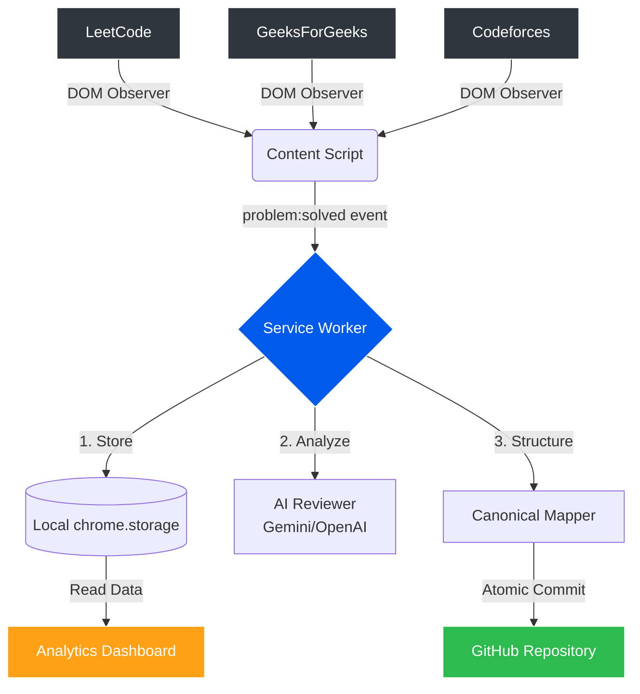
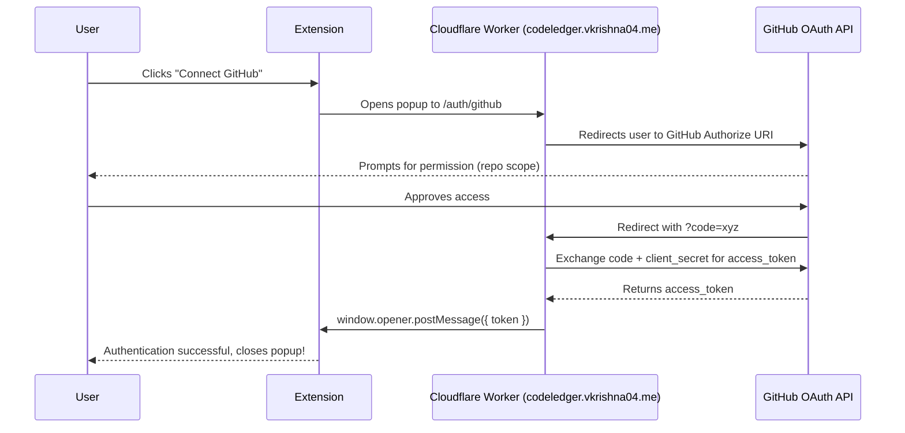

[](LICENSE)
[](https://developer.chrome.com/docs/extensions/mv3/intro/)
[](https://addons.mozilla.org/en-US/firefox/addon/codeledger/)
[](https://chrome.google.com/webstore/detail/codeledger/)
[](docs/ADDING_PLATFORM_HANDLER.md)
[](https://counter.vkrishna04.me)
[](https://counter.vkrishna04.me)

<div align="center">
  <h1>CodeLedger</h1>
  <p><strong>Your DSA Journey, Committed.</strong></p>
  <p>Single GitHub repo. Every problem. Every language. Owned entirely by you.</p>
</div>

## 🌟 Why CodeLedger exists

**Situation:** DSA practice is scattered across 5+ platforms. Solutions get lost. Progress is invisible to recruiters. There's no single view of what you've built.

**Task:** Unify all platforms into one developer-owned, Git-backed record of every DSA problem ever solved — searchable, graphable, AI-reviewable, and automatically visible on your GitHub contribution graph.

**Action:** A plugin-based MV3 browser extension where the core has zero website-specific logic. Each platform is a self-contained handler. Every solve triggers a single atomic Git commit via the Tree API. Cross-browser sync uses the repo's own index.json as the source of truth — like MALSync but for DSA. Community-voted canonical mappings (SponsorBlock model) unify the same problem across platforms. AI review with round-robin key pools and fallback provider chains. Knowledge graph built from your solved problems.

**Result:** One repo. Every problem. Every language. Visible on your GitHub profile. Owned entirely by you. Shareable on your portfolio. No servers.

## ✨ Core Features

*   **⚡ Zero-Click Atomic Commits:** Submit a successful solution and CodeLedger instantly commits it (Code, Hint, and README) straight to your GitHub via a background Service Worker using the GitHub Trees API.
*   **🌍 Multi-Platform Sync:** Supports LeetCode, GeeksForGeeks, and Codeforces out-of-the-box.
*   **🧠 Automated AI Code Reviews:** Plug in an API key to receive instant time/space complexity analysis and hints for optimization directly in your repo.
*   **📊 Unified Analytics Dashboard:** A gorgeous, centralized dashboard (`/library`) giving you visual insights into your topic mastery, GitHub-style consistency map, and tailored problem recommendations.
*   **🕵️ Incognito Awareness:** CodeLedger detects Incognito mode and strictly pauses syncing to respect your privacy.
*   **🛡️ 100% Data Ownership:** All data is pushed to your GitHub or stored locally in `chrome.storage.local`. No centralized database scraping.

## 🏗️ Architecture

CodeLedger operates as an event-driven standard MV3 Extension composed of Content Scripts injected into specific platforms, a robust Service Worker for background orchestration, and a local UI/Analytics dashboard.



### GitHub App Setup (Self-Hosting OAuth)

If you are a developer compiling the extension from source and do not want to use the public codeledger.vkrishna04.me OAuth bridge, you must register your own GitHub App.

1. Go to **GitHub Developer Settings** -> **GitHub Apps** -> **New GitHub App**.
2. **GitHub App name:** `CodeLedger Dev` (or similar).
3. **Homepage URL:** (Optional, your GitHub profile/repo URL).
4. **Callback URL:** If using a web-backend like Cloudflare Workers, use `https://<your-worker-url>.workers.dev/auth/github/callback`. For Chrome Extension direct flows, use `https://<extension-id>.chromiumapp.org/`.
5. **Webhook:** Disable Webhook (Active: false).
6. **Permissions:**
   * **Repository Permissions:**
     * `Contents`: **Read & Write** (Required to read existing trees and commit code files).
     * `Administration`: **Read & Write** (Required to create the repository if it doesn't exist).
7. **Create GitHub App**.
8. **Client Secret:** Generate a new Client Secret and keep it safe alongside the Client ID.

Update your Cloudflare Worker or backend using these credentials.



## 🚀 Getting Started

### 1. Installation

**Chrome / Edge / Brave (Chromium)**
1. Go to `chrome://extensions/`
2. Enable **Developer mode** in the top right.
3. Click **Load unpacked** and select the `/dist/unpacked` directory inside this project.

**Firefox**
1. Go to `about:debugging#/runtime/this-firefox`
2. Click **Load Temporary Add-on** and select the `manifest.json` from the `/dist/unpacked` folder.

### 2. Configuration

1. Click the **CodeLedger** icon in your browser toolbar to open the popup.
2. Under **Git Integration**, click **Connect** to securely acquire an OAuth token.
3. Set your **Repository Name** (e.g., `CodeLedger-Sync`). The extension will automatically create and initialize this repo if it doesn't exist.
4. *(Optional)* Provide an API key under the AI Providers section to unlock automated Big-O reviews.

## 🛠️ Development

Build tools are managed via standard NPM scripts utilizing `tsx` for high-speed builds.

```bash
# Install dependencies
npm install

# Start development build watcher (auto-syncs to /dist/unpacked)
npm run watch

# Create production zip builds for Chrome & Firefox
npm run build
```

The UI is built utilizing **Preact** without a compiler (using `htm`) and styled with **Tailwind CSS**, keeping the extension footprint extremely small.

## 🤝 Contributing

We welcome pull requests! Whether it's adding support for a new platform (like HackerRank or AtCoder) or a new AI provider provider, check out our [Architecture Guide](docs/ARCHITECTURE.md) to understand the Base Handler abstract classes.

