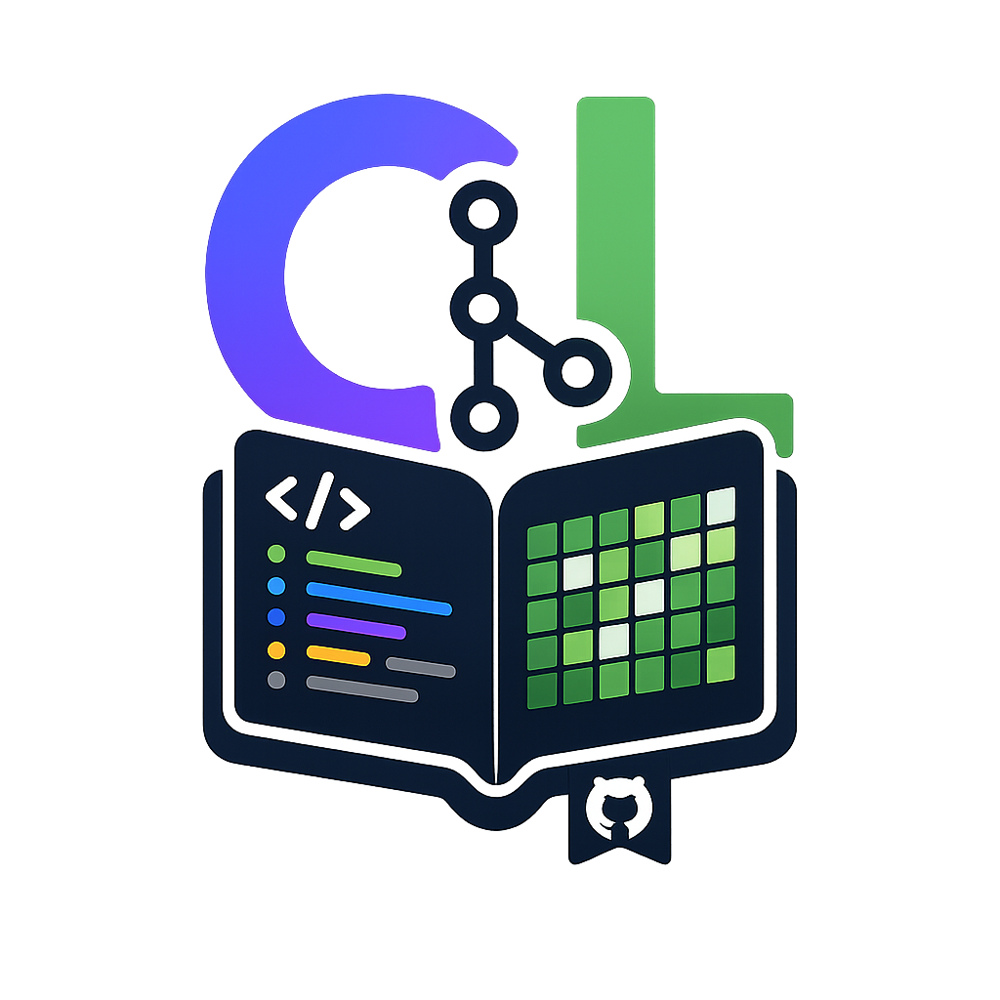
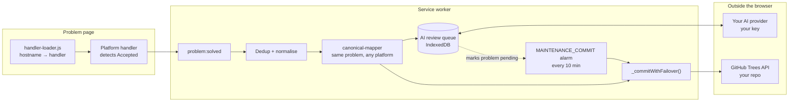
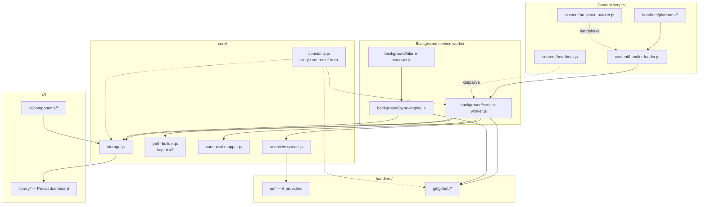
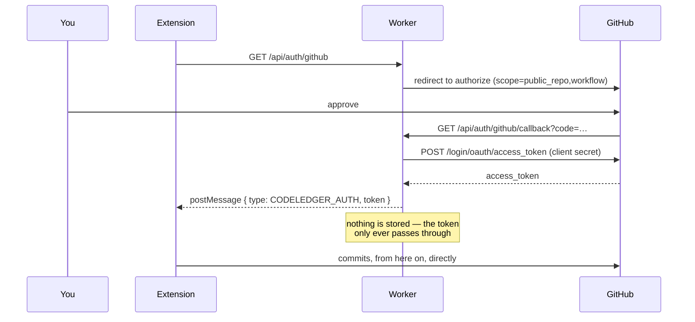

<!--
 @license
 SPDX-License-Identifier: Apache-2.0
 -->

<div align="center">



# CodeLedger

**Your DSA grind, on your GitHub. Automatically.**

_Zero-click commits · AI code review · Live analytics · Knowledge graph · Bulk LeetCode import_

<br/>

[](https://github.com/Life-Experimentalist/Code-Ledger/stargazers) [](https://github.com/Life-Experimentalist/Code-Ledger/network/members) [](LICENSE.md) [](https://developer.chrome.com/docs/extensions/mv3/intro/) [](docs/CHANGELOG.md)

<br/>

[](https://chromewebstore.google.com/detail/codeledger/dpalidbhndcbppmjgmbloffehbhfchmb) [](https://addons.mozilla.org/en-US/firefox/addon/code-ledger/) [](https://github.com/Life-Experimentalist/Code-Ledger/releases/latest)

<br/>


</div>

<br/>

---

## The Problem

You grind DSA every day. Your GitHub looks empty. Your solutions disappear into LeetCode's servers. When a recruiter asks to see your work, you have nothing to show — even though you've been coding for months.

**CodeLedger fixes that.** Install the extension, connect your GitHub, and every accepted solution gets committed automatically — code, problem statement, AI review, and all. Your profile becomes a living portfolio. Zero extra steps.

---

## How It Works


```mermaid
flowchart LR
    subgraph page["Problem page"]
        HL["handler-loader.js<br/>hostname → handler"]
        PH["Platform handler<br/>detects Accepted"]
    end

    subgraph sw["Service worker"]
        EV["problem:solved"]
        DED["Dedup + normalise"]
        CAN["canonical-mapper<br/>same problem, any platform"]
        AIQ[("AI review queue<br/>IndexedDB")]
        MNT["MAINTENANCE_COMMIT alarm<br/>every 10 min"]
        COM["_commitWithFailover()"]
    end

    subgraph out["Outside the browser"]
        AI["Your AI provider<br/>your key"]
        GH["GitHub Trees API<br/>your repo"]
    end

    HL --> PH --> EV --> DED --> CAN
    CAN --> COM
    CAN --> AIQ
    AIQ <--> AI
    AIQ -.->|marks problem pending| MNT
    MNT --> COM
    COM --> GH
```

The commit path and the review path are deliberately separate. A slow or failing AI provider never delays or blocks the commit. A finished review is written to IndexedDB and the problem is flagged pending; a maintenance alarm running every ten minutes rolls all pending reviews and metadata into one further atomic commit, rather than one commit per review.

---

## What Gets Committed

One accepted submission produces one atomic commit through the GitHub Trees API — never a partial write, never one commit per file.

```
problems/two-sum/leetcode/
├── lc-two-sum.py        ← your code, exactly as submitted
└── README.md            ← statement, hints, runtime/memory, AI review

index.json               ← machine-readable history (rewritten every commit)
README.md                ← stats dashboard, regenerated in the same commit
index.html               ← GitHub Pages dashboard, same commit
.codeledger/
├── sync.json            ← portable settings backup
├── behaviour-bank.json  ← your AI skill definitions and insights
└── roadmaps.json        ← learning roadmaps
```

`two-sum` is the **canonical ID**. When the same problem exists on more than one platform, every platform's solution lands under the same canonical directory, so `problems/two-sum/leetcode/` and `problems/two-sum/geeksforgeeks/` sit side by side. If no canonical mapping is known, the layout falls back to `problems/lc-two-sum/`.

---

## Install

| Browser              | Install                                                                                                     |
| -------------------- | ----------------------------------------------------------------------------------------------------------- |
| Chrome / Edge / Brave | [Chrome Web Store](https://chromewebstore.google.com/detail/codeledger/dpalidbhndcbppmjgmbloffehbhfchmb)     |
| Firefox              | [Firefox Add-ons](https://addons.mozilla.org/en-US/firefox/addon/code-ledger/)                               |
| Any                  | [Download a release zip](https://github.com/Life-Experimentalist/Code-Ledger/releases/latest) and load it unpacked |

**Loading unpacked from source:**

```
Chromium   chrome://extensions  →  Developer mode ON  →  Load unpacked  →  select src/
Firefox    about:debugging      →  Load Temporary Add-on  →  select dist/firefox/manifest.json
```

Firefox needs `npm run build` first, because it loads a single `manifest.json` that the build emits per target.

---

## Setup (2 minutes)

1. Click the **CodeLedger** icon in your toolbar.
2. Click **Connect GitHub**. The OAuth exchange runs through the Cloudflare Worker at `codeledger.vkrishna04.me`, which swaps the authorisation code for a token and returns it to the extension. The token is stored in your browser and never on the worker.
3. Pick a **repo name** (e.g. `my-dsa-solutions`). CodeLedger creates it and writes the first commit itself.
4. Solve a problem. Check your GitHub.

CodeLedger requests `public_repo` and `workflow` by default — enough to create a public repository, push to it, and write the GitHub Pages workflow. Choose the broader `repo` scope during authorisation if you want your solutions in a private repository.

> **Optional:** add an AI provider key under Settings → AI to turn on code review.

---

## Supported Platforms

| Platform          | Solve detection                        | Bulk history import |
| ----------------- | -------------------------------------- | ------------------- |
| **LeetCode**      | GraphQL submission polling + DOM       | Yes — Progress page |
| **GeeksForGeeks** | DOM + Ace editor extraction            | Yes — profile page  |
| **Codeforces**    | Submission-status DOM observation      | No                  |

Each platform is a self-contained directory under `src/handlers/platforms/`. Adding another one requires no changes to the core — see [the handler contract](docs/guides/development/adding-platform-handler.md).

---

## Supported AI Providers

| Provider                    | Notes                            |
| --------------------------- | -------------------------------- |
| Google Gemini               | Default — free tier available    |
| OpenAI                      | Bring your own key               |
| Anthropic Claude            | Bring your own key               |
| DeepSeek                    | Bring your own key               |
| Ollama                      | Local models — no API key needed |
| OpenRouter                  | Access many models with one key  |

Keys are stored in your browser under `ai.keys` and are sent only to the provider you selected. If a provider fails, the queue retries and can fall back to another configured provider.

---

## What You Get

|                          |                                                                                                                                                                                                   |
| ------------------------ | ------------------------------------------------------------------------------------------------------------------------------------------------------------------------------------------------- |
| **Zero-click commits**   | Every accepted submission is committed the moment it is accepted — solution file and problem statement in one atomic commit.                                                                       |
| **Bulk import**          | Pull your existing LeetCode or GeeksForGeeks history in from your profile page: past accepted solutions with code, statements and stats, committed in batched commits.                             |
| **AI code review**       | Complexity analysis, optimisation suggestions and hints, committed alongside your code. Six providers, your own keys.                                                                              |
| **Live dashboard**       | A heatmap, topic radar, difficulty breakdown and solve-velocity chart, generated into your repo and served from your own GitHub Pages.                                                             |
| **Knowledge graph**      | A force-directed graph of everything you have solved, linked by topic.                                                                                                                             |
| **AI chat panel**        | A floating panel on every problem page. Ask about complexity, request hints, paste errors — your code is available to the chat via `/mycode`.                                                      |
| **AI Behaviour Bank**    | Personal memory for the assistant: saved insights, named skills that trigger on command, and learning roadmaps that inject context into every chat.                                                |
| **Cross-device sync**    | A `chrome.alarms` job polls your repo's `index.json` and reconciles it with local IndexedDB, so any machine you install on catches up on its own.                                                  |
| **Rolling backups**      | Scheduled snapshots of problems and settings committed to your repo. Restore in one click.                                                                                                         |
| **100% yours**           | Your code goes from your browser straight to your repo. The only server this project runs is the OAuth relay.                                                                                      |

---

## Architecture


```mermaid
flowchart TB
    subgraph content["Content scripts"]
        LOAD["content/handler-loader.js"]
        PLAT["handlers/platforms/*"]
        MARK["content/presence-marker.js"]
        BEAT["content/heartbeat.js"]
    end

    subgraph background["Background service worker"]
        SWK["background/service-worker.js"]
        SYNC["background/sync-engine.js"]
        ALRM["background/alarm-manager.js"]
    end

    subgraph core["core/"]
        CONST["constants.js<br/>single source of truth"]
        STORE["storage.js"]
        PATH["path-builder.js<br/>layout v3"]
        MAP["canonical-mapper.js"]
        QUEUE["ai-review-queue.js"]
    end

    subgraph handlers["handlers/"]
        AIH["ai/* — 6 providers"]
        GITH["git/github/*"]
    end

    subgraph ui["UI"]
        LIB["library/ — Preact dashboard"]
        SET["ui/components/*"]
    end

    PLAT --> LOAD --> SWK
    MARK -.->|handshake| LOAD
    BEAT -.->|keepalive| SWK
    SWK --> STORE & PATH & MAP & QUEUE
    QUEUE --> AIH
    SWK --> GITH
    ALRM --> SYNC --> GITH
    SYNC --> STORE
    STORE --> LIB
    CONST -.-> SWK & GITH & STORE
    SET --> STORE
```

No bundler, no transpiler. Pure ES6 modules; Preact and htm come from `src/vendor/preact-bundle.js`, a local bundle generated by `npm run vendor:preact` and committed to the repo, so nothing is fetched from a CDN at runtime. Tailwind is compiled ahead of time into a single stylesheet.

Two rules hold everywhere:

- Every extension API call goes through `src/lib/browser-compat.js`. Nothing else touches `chrome.*` or `browser.*`.
- Every log goes through `createDebugger()` from `src/lib/debug.js`, which preserves the caller's file and line in DevTools.

See [docs/architecture/system-architecture.md](docs/architecture/system-architecture.md) for the full component breakdown.

---

## The Worker

A single Cloudflare Worker (Hono) does two jobs: it relays the GitHub OAuth code exchange, and it serves the static landing page.


```mermaid
sequenceDiagram
    participant U as You
    participant E as Extension
    participant W as Worker
    participant G as GitHub

    E->>W: GET /api/auth/github
    W->>G: redirect to authorize (scope=public_repo,workflow)
    U->>G: approve
    G->>W: GET /api/auth/github/callback?code=…
    W->>G: POST /login/oauth/access_token (client secret)
    G-->>W: access_token
    W-->>E: postMessage { type: CODELEDGER_AUTH, token }
    Note over W: nothing is stored — the token<br/>only ever passes through
    E->>G: commits, from here on, directly
```

The route contract is specified in [docs/OPENAPI.yaml](docs/OPENAPI.yaml) and validated in CI.

---

## Privacy

Your solutions, your tokens and your AI keys stay in your browser and go only to the services you chose. There is no account and no server-side copy of your data.

One optional exception: **Anonymous Usage Stats**, off unless you turn it on in Settings → Advanced. When enabled, each committed solve sends a counter hit containing the platform name and extension version — nothing else, no identifier of any kind. Full detail in [PRIVACY.md](PRIVACY.md).

---

## For Developers

```bash
npm install
npm run build:css        # Tailwind → src/ui/styles/compiled.css
npm run build            # CSS + per-target dist/
npm run lint             # tsc --noEmit type check
npm run format           # prettier over src, dev, worker
npm test                 # node:test — extension + worker suites
npm run validate:openapi # worker routes must match the spec
npm run release          # validate → build → zip → commit → tag → push
npm run release -- --dry-run
```

CI runs the same gate on every push and pull request, plus a packaging build.

### Adding a platform handler

1. Create `src/handlers/platforms/{name}/index.js` extending `BasePlatformHandler`.
2. Add `dom-selectors.js` (with a `DOMAINS` export) and `page-detector.js` alongside it.
3. Add the hostname branch in `src/content/handler-loader.js`.
4. Run `npm run domains:update` to regenerate `host_permissions` in both manifests.

The full contract is in [docs/guides/development/adding-platform-handler.md](docs/guides/development/adding-platform-handler.md). LeetCode's handler is the reference implementation.

### Adding an AI provider

1. Create `src/handlers/ai/{name}/index.js` extending `BaseAIHandler`, plus `model-fetcher.js`.
2. Add the provider to `CONSTANTS.AI_PROVIDERS` in `src/core/constants.js`.
3. Register its settings schema in `src/handlers/init.js` and wire it into `ModelSelector.js`.

### Self-hosting the worker

1. Register a GitHub **OAuth App** (not a GitHub App — GitHub Apps ignore the `scope` parameter and issue user-to-server tokens that cannot create repositories). Callback URL: `https://<your-worker>/api/auth/github/callback`.
2. Copy `worker/wrangler.toml.example` to `worker/wrangler.toml`, then set the secrets it lists with `npx wrangler secret put <NAME>`.
3. Point `CONSTANTS.URLS.AUTH_WORKER` in `src/core/constants.js` at your worker.
4. `npm run deploy:worker`.

---

## Contributing

Read [.github/CONTRIBUTING.md](.github/CONTRIBUTING.md) before opening a PR. Open tickets live in [docs/reference/backlog.md](docs/reference/backlog.md).

Before pushing: `npm run lint && npm run format:check && npm test`.

---

## Documentation

- Changelog: [docs/CHANGELOG.md](docs/CHANGELOG.md)
- Architecture: [docs/architecture/system-architecture.md](docs/architecture/system-architecture.md)
- Queues and orchestration: [docs/queues/orchestration.md](docs/queues/orchestration.md)
- Testing guide: [docs/TESTING_GUIDE.md](docs/TESTING_GUIDE.md)
- OpenAPI contract: [docs/OPENAPI.yaml](docs/OPENAPI.yaml)
- Adding a platform: [docs/guides/development/adding-platform-handler.md](docs/guides/development/adding-platform-handler.md)
- Security policy: [.github/SECURITY.md](.github/SECURITY.md)

---

<div align="center">


**[codeledger.vkrishna04.me](https://codeledger.vkrishna04.me)** · [Apache 2.0](LICENSE.md)

_Fork it. Self-host it. Own your data._

</div>
