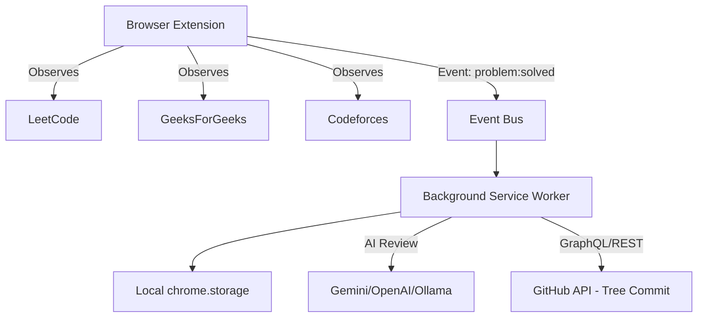
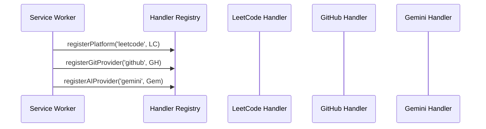
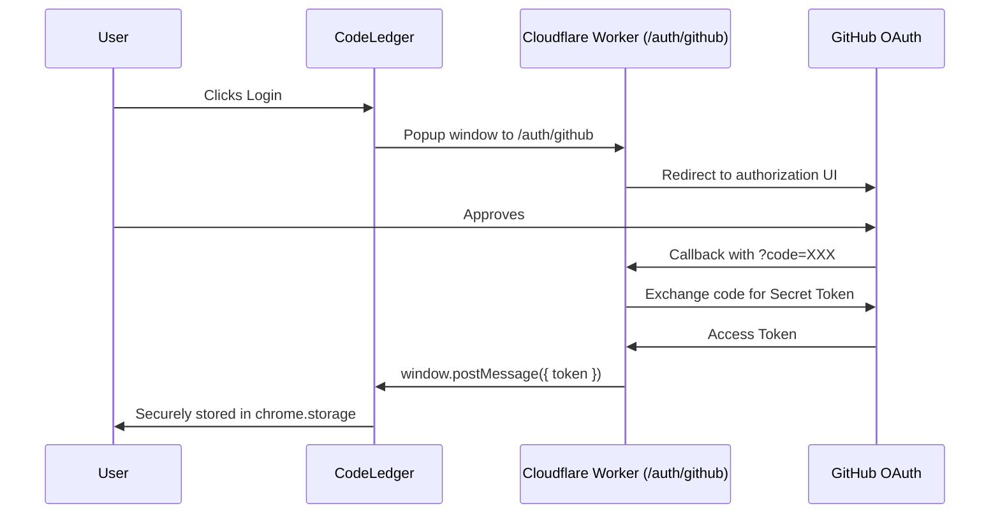
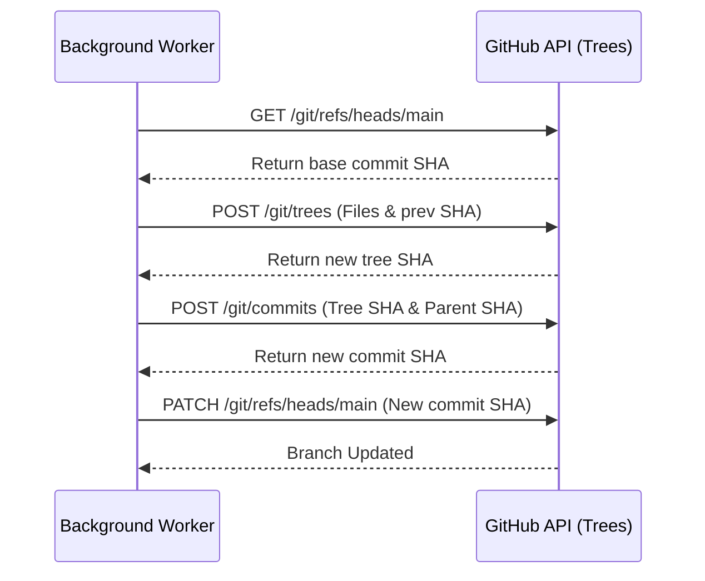

# CodeLedger Architecture

CodeLedger is built using a modern, event-driven pattern designed for Manifest V3 (MV3). It avoids hardcoding platform logic directly into the core engine, utilizing a plugin architecture instead.

## 1. System Overview Flowchart

At a high level, CodeLedger relies on Content Scripts injected into specific platforms to parse the DOM and detect successful code submissions.

**Explanation:**
When a user submits a passing solution on LeetCode or GeeksForGeeks, the specific *Platform Handler* detects this via DOM polling or intercepting `fetch` requests. It emits a universal `problem:solved` event. The Background Service Worker listens to this and acts as the orchestrator: it saves the file locally, sends the code for AI review if enabled, and ultimately performs an atomic commit to the user's Git repository.

## 2. Plugin Registration Sequence

CodeLedger uses an internal `HandlerRegistry` to decouple logic.

**Explanation:**
Upon installation or startup, the Service Worker initializes `BasePlatformHandler`, `BaseGitHandler`, and `BaseAIHandler` instances. This design means that adding a new platform (like HackerRank) only requires writing a single isolated class and registering it. 

## 3. GitHub Secure OAuth Flow

Since MV3 service workers and cross-origin isolation make OAuth tricky without hosting a dedicated server, we use a lightweight serverless Cloudflare Worker proxy.

**Explanation:**
Cloudflare routes the user to GitHub and receives the callback containing a temporary `code`. Our worker exchanges this code + our app's `client_secret` (which safely lives strictly on the server) for a permanent `access_token`. This access token is transmitted securely back to the origin popup via HTML5 `postMessage`, completing the login flow.

## 4. Git Atomic Commit

CodeLedger uses the GitHub Git Data APIs (`/git/trees`, `/git/commits`, `/git/refs`) to ensure that multiple files (e.g. `index.json`, `solution.js`, `README.md`) are pushed in a single network action without cloning the repository.

**Explanation:**
Instead of mutating files sequentially (which ruins commit history), CodeLedger fetches the head SHA, mounts the newly generated `tree` of changes on top of it, creates a commit object, and forces the `head` pointer forward in one clean atomic step.

---

*(Additional architecture diagrams regarding Cross Browser Sync, Canonical Maps, and Round-Robin API Fallbacks are defined in upcoming updates.)*
