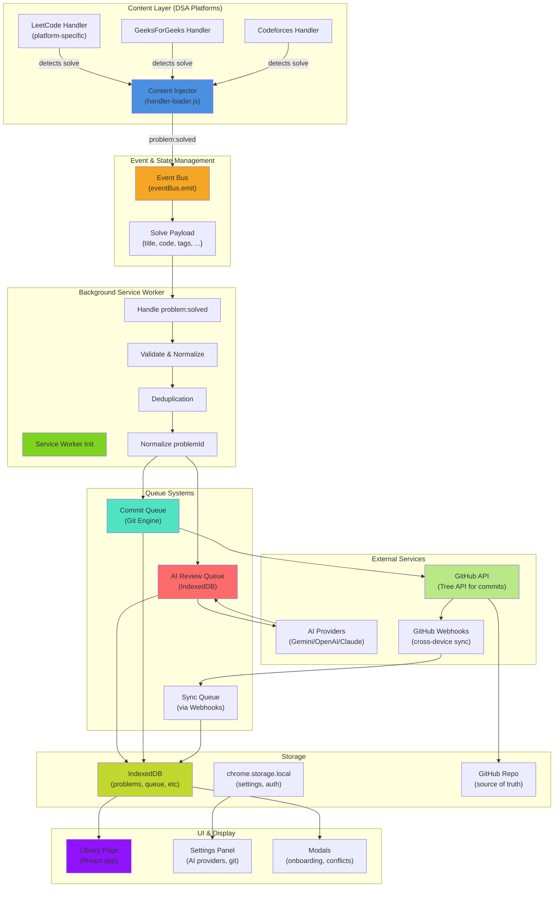
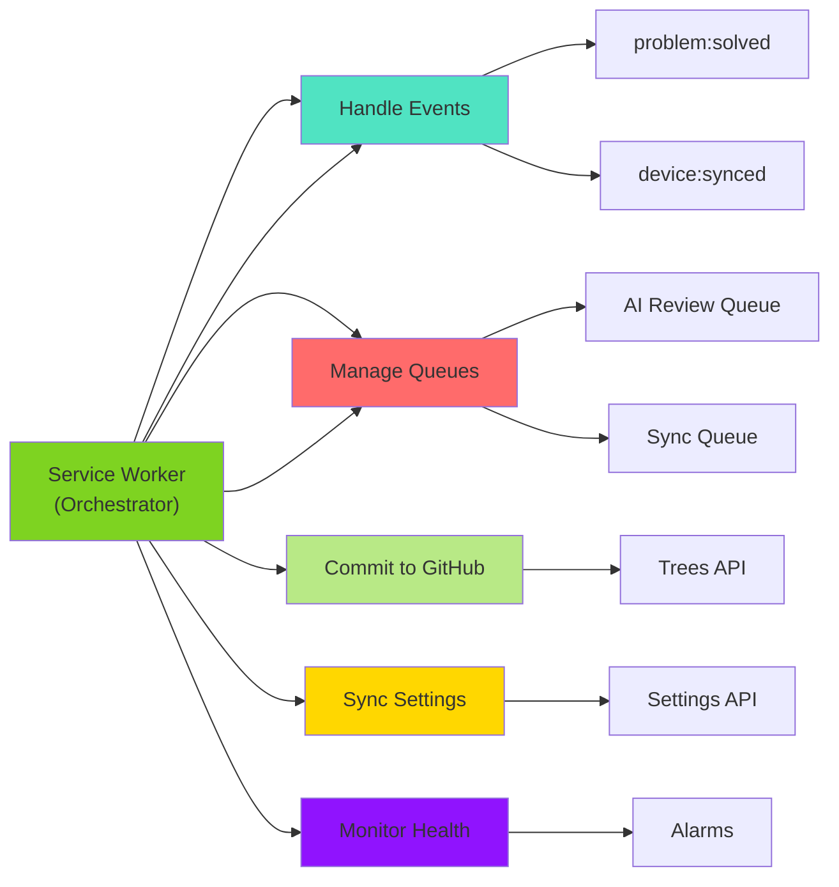
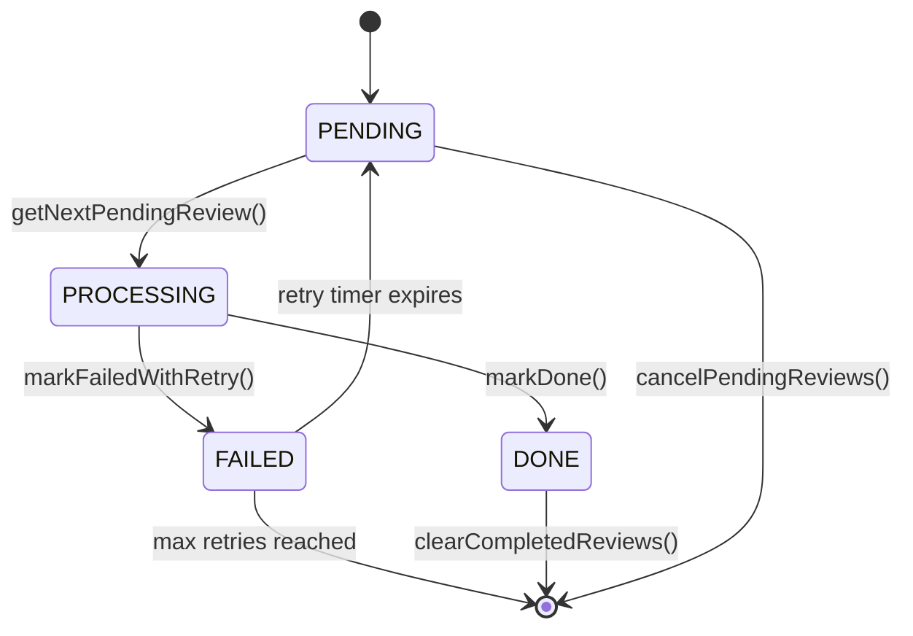
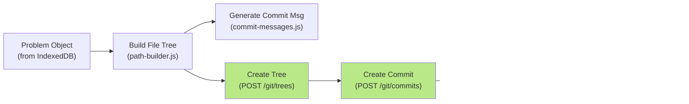
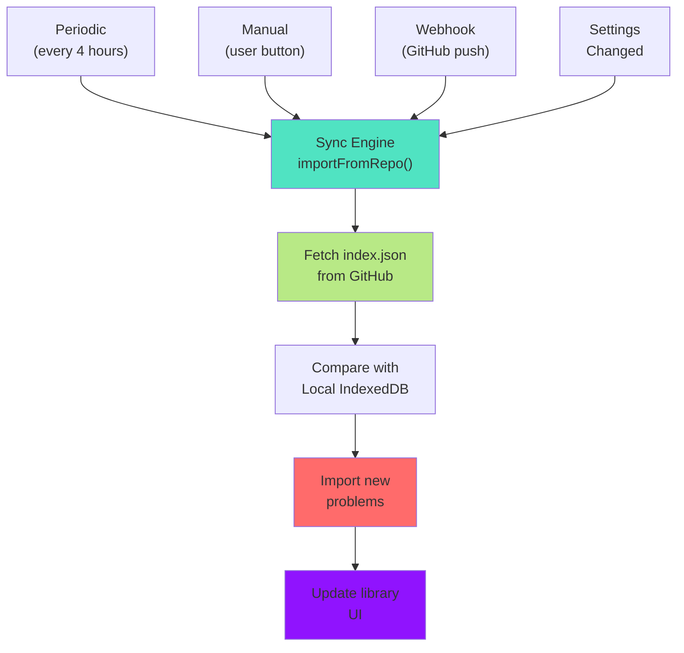
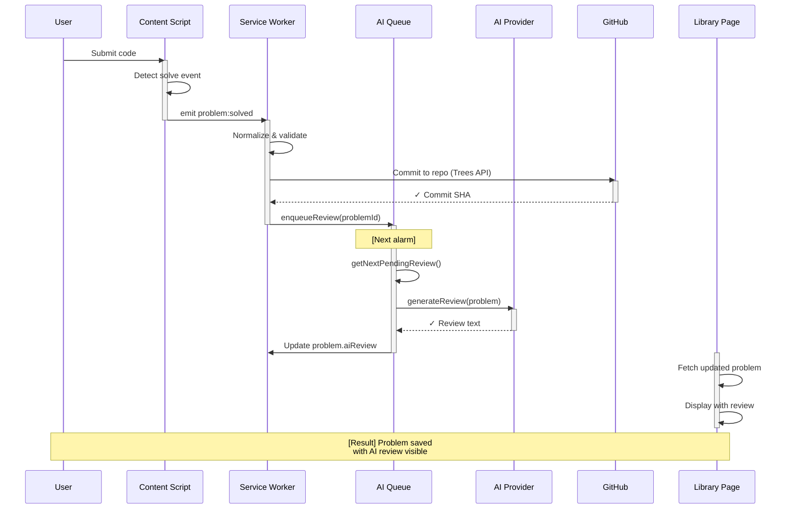

# CodeLedger Complete System Architecture

**Comprehensive overview of all components, data flows, and interactions**

---

## Quick Links

- **[Queues & Orchestration](../queues/orchestration.md)** — AI Review, Commit, and Sync Queues
- **[Architecture](./README.md)** — High-level system design
- **[Adding Platform Handlers](../guides/development/adding-platform-handler.md)** — Extend to new platforms
- **[Graphify Workflow](../guides/development/graphify-workflow.md)** — Build and inspect project knowledge graph

---

## Complete System Flowchart



---

## Component Breakdown

### 1. Content Scripts Layer

**Purpose:** Detect when user solves a DSA problem on supported platforms

| Component             | File                                             | Responsibility                             |
| --------------------- | ------------------------------------------------ | ------------------------------------------ |
| **Handler Loader**    | `src/content/handler-loader.js`                  | Router: matches hostname → imports handler |
| **Platform Handlers** | `src/handlers/platforms/{name}/`                 | Detects solve, extracts metadata           |
| **DOM Detectors**     | `src/handlers/platforms/{name}/page-detector.js` | Identify page type (problem, solve, etc)   |
| **Heartbeat**         | `src/content/heartbeat.js`                       | Keepalive for service worker connection    |

**Data Extracted:**

```javascript
{
    title: "Two Sum",                    // Problem name
    titleSlug: "two-sum",                // URL-safe name
    code: "function twoSum(...) { ... }", // User's solution
    lang: { name: "JavaScript", ext: "js", slug: "js" },
    platform: "leetcode",                // Platform ID
    difficulty: "Easy",                  // Normalized difficulty
    runtime: "75ms",                     // Performance metrics
    memory: "45MB",
    runtimePct: 95,                     // Percentile ranking
    memoryPct: 87,
    tags: ["array", "hash-table"],      // Problem tags
    timestamp: Date.now(),               // Unix milliseconds
    elapsedSeconds: 245,                 // Time spent solving (from floating timer)
}
```

---

### 2. Event Bus & Orchestration

**Purpose:** Decouple platform detection from processing logic

**File:** `src/core/event-bus.js`

```javascript
// Publish from content script
eventBus.emit("problem:solved", {
  title: "Two Sum",
  code: "...",
  // ... rest of payload
});

// Consume in service worker
eventBus.on("problem:solved", async (payload) => {
  // Process: validate, deduplicate, commit, enqueue
});
```

**Other Events:**

- `problem:started` — User opens a problem
- `metadata:refresh` — Background refresh needed
- `device:synced` — Webhook received, problems updated

---

### 3. Service Worker (Background)

**Purpose:** Orchestrate all processing, manage queues, handle GitHub integration

**File:** `src/background/service-worker.js`

#### Main Responsibilities



#### Key Functions

| Function                        | Purpose                      | Async | Log Level |
| ------------------------------- | ---------------------------- | ----- | --------- |
| `init()`                        | Bootstrap service worker     | ✓     | DEBUG     |
| `handleSolved(payload)`         | Process problem solve event  | ✓     | DEBUG     |
| `generateAIReview(problem)`     | Call AI provider for review  | ✓     | DEBUG     |
| `commitUpdatedProblem(problem)` | Atomic GitHub commit         | ✓     | DEBUG     |
| `processAIReviewQueue()`        | Alarm handler: process queue | ✓     | DEBUG     |
| `handleResyncAll()`             | Force full sync from GitHub  | ✓     | DEBUG     |
| `handleMessage(msg, sender)`    | Content script messages      | ✓     | LOG       |

---

### 4. AI Review Queue System

**Purpose:** Manage asynchronous AI reviews with retry logic and prioritization

**File:** `src/core/ai-review-queue.js`

#### State Machine



#### Operations & Logging

```javascript
// Each operation has comprehensive debug logging:

// 1. Initialize queue store
async function initializeReviewQueueStore() {
  dbg.log(`initializeReviewQueueStore(): creating indexes...`);
  // Creates IndexedDB + indexes
  dbg.log(`initializeReviewQueueStore(): ✓ store ready`);
}

// 2. Enqueue a review
async function enqueueReview(problemId, priority = 100) {
  dbg.log(`enqueueReview(${problemId}, priority=${priority}): entering`);

  // Check for duplicates
  const existing = await getPendingReviewsForProblem(problemId);
  if (existing.length > 0) {
    dbg.log(`enqueueReview(): ${problemId} already queued — skipping`);
    return { skipped: true };
  }

  // Insert into queue
  const id = `review-${problemId}-${Date.now()}`;
  // ... database insert

  dbg.log(`enqueueReview(): ✓ ${problemId} added to queue (id=${id})`);
  return { id, status: "pending", skipped: false };
}

// 3. Get next item
async function getNextPendingReview() {
  dbg.log(`getNextPendingReview(): fetching next pending item...`);

  const item = await _queryQueueBy("status", "pending");

  if (!item) {
    dbg.log(`getNextPendingReview(): queue empty`);
    return null;
  }

  dbg.log(
    `getNextPendingReview(): ✓ found ${item.problemId} (priority=${item.priority})`,
  );
  return item;
}

// 4. Mark as processing
async function markProcessing(itemId) {
  dbg.log(`markProcessing(${itemId}): transitioning to PROCESSING...`);

  await _updateQueueItem(itemId, {
    status: "processing",
    lastAttempt: Date.now(),
  });

  dbg.log(`markProcessing(${itemId}): ✓ now processing`);
}

// 5. Mark as done
async function markDone(itemId) {
  dbg.log(`markDone(${itemId}): transitioning to DONE...`);

  await _updateQueueItem(itemId, {
    status: "done",
    updatedAt: Date.now(),
  });

  dbg.log(`markDone(${itemId}): ✓ complete`);
}

// 6. Mark as failed with retry
async function markFailedWithRetry(itemId, error) {
  dbg.log(`markFailedWithRetry(${itemId}): error=${error}`);

  const item = await _getQueueItem(itemId);
  const retryCount = (item.retryCount || 0) + 1;

  if (retryCount > MAX_RETRIES) {
    dbg.error(`markFailedWithRetry(${itemId}): max retries exceeded`);
    // ... stay in FAILED
  } else {
    const backoff = Math.min(
      RETRY_BASE_DELAY_MS * Math.pow(2, retryCount - 1),
      RETRY_MAX_DELAY_MS,
    );
    const nextRetryTime = Date.now() + backoff;

    dbg.log(
      `markFailedWithRetry(${itemId}): retry #${retryCount} scheduled for +${backoff}ms`,
    );

    await _updateQueueItem(itemId, {
      status: "failed",
      retryCount,
      nextRetryTime,
      error,
      updatedAt: Date.now(),
    });
  }
}

// 7. Get statistics
async function getQueueStats() {
  dbg.log(`getQueueStats(): fetching current queue status...`);

  const stats = {
    pending: 0,
    processing: 0,
    done: 0,
    failed: 0,
    total: 0,
  };

  // Count by status
  // ...

  dbg.log(
    `getQueueStats(): ✓ pending=${stats.pending}, processing=${stats.processing}, done=${stats.done}, failed=${stats.failed}`,
  );
  return stats;
}
```

---

### 5. Git Engine (Commit Processing)

**Purpose:** Create atomic, multi-file commits to GitHub using Trees API

**File:** `src/handlers/git/github/index.js`, called through `_commitWithFailover()` in `src/background/service-worker.js`

#### Commit Flow



#### Example: Files Generated for Commit

```javascript
// For problem: "Two Sum" (leetcode)
{
    "arrays/two-sum/two-sum.js": `
        function twoSum(nums, target) {
            const map = new Map();
            for (let i = 0; i < nums.length; i++) {
                if (map.has(target - nums[i])) {
                    return [map.get(target - nums[i]), i];
                }
                map.set(nums[i], i);
            }
            return [];
        }
    `,

    "arrays/two-sum/index.json": {
        "problemId": "lc/1",
        "title": "Two Sum",
        "platform": "leetcode",
        "difficulty": "Easy",
        "lang": { "name": "JavaScript", "ext": "js" },
        "tags": ["array", "hash-table"],
        "runtime": "75ms",
        "memory": "45MB",
        "runtimePct": 95,
        "memoryPct": 87,
        "aiReview": "Well-optimized solution using hash map for O(n) time complexity.",
        "timestamp": 1715600000000,
        "elapsedSeconds": 245
    }
}
```

#### Commit Message Types

```javascript
// Determined by detectDuplicate + existing problem check

// New problem:
"solve(arrays/two-sum): Two Sum — O(n) hash table solution";

// Re-solved with same code:
"metadata(arrays/two-sum): Update runtime metrics";

// Re-solved with different code:
"optimize(arrays/two-sum): Improved solution using hash map";

// Code improvement:
"refactor(arrays/two-sum): Better variable names, added comments";
```

---

### 6. Sync Engine (Cross-Device)

**Purpose:** Keep problems in sync across multiple devices

**File:** `src/background/sync-engine.js`

#### Sync Triggers



#### Import Logic

```javascript
// Sync flow pseudocode
async function importFromRepo() {
  dbg.log(`importFromRepo(): fetching latest index.json...`);

  // 1. Fetch remote index
  const remoteIndex = await ghGetContents(owner, repo, "index.json");

  dbg.log(
    `importFromRepo(): ✓ fetched ${Object.keys(remoteIndex).length} remote problems`,
  );

  // 2. Get local problems
  const localProblems = await Storage.getAllProblems();
  const localIndex = {};
  localProblems.forEach((p) => {
    localIndex[p.problemId] = p;
  });

  dbg.log(
    `importFromRepo(): local has ${Object.keys(localIndex).length} problems`,
  );

  // 3. Detect new (not in local)
  const newProblems = [];
  for (const [problemId, remote] of Object.entries(remoteIndex)) {
    if (!localIndex[problemId]) {
      dbg.log(`importFromRepo(): new problem detected: ${problemId}`);
      newProblems.push(remote);
    }
  }

  // 4. Import each new problem
  for (const remote of newProblems) {
    const imported = await applyImport(remote);
    dbg.log(`importFromRepo(): ✓ imported ${remote.problemId}`);
  }

  dbg.log(
    `importFromRepo(): ✓ sync complete — ${newProblems.length} new problems`,
  );
}
```

---

### 7. Settings Management

**Purpose:** Persist and sync user configuration (providers, git setup, etc)

**File:** `src/core/settings-sync.js` + `src/core/settings-auto-commit.js`

#### Settings Schema

```javascript
{
    // GitHub Configuration
    github_owner: "VKrishna04",
    github_repo: "DSA-Solutions",
    github_token: null,  // OAuth token (never manual)

    // AI Providers
    ai_providers: {
        gemini: { enabled: true, apiKey: "sk-..." },
        openai: { enabled: false, apiKey: null },
        claude: { enabled: true, apiKey: "sk-..." }
    },

    // AI Review Settings
    aiReviewEnabled: true,
    preferredAIProvider: "gemini",
    aiReviewOnSolve: true,

    // Platform Sync
    enabledPlatforms: {
        leetcode: true,
        geeksforgeeks: true,
        codeforces: true
    },

    // UI Preferences
    theme: "dark",
    language: "en",
    telemetryEnabled: true,

    // Timestamps
    lastKnownVersion: "1.2.0",
    extensionUpdated: false,

    // Internal flags
    settingsPendingCommit: false,  // Flag for auto-commit queue
    lastSyncTime: 1715600000000
}
```

#### Auto-Commit Logic

```javascript
// Every 30 seconds:
async function handleSettingsCommitAlarm() {
  dbg.log(`handleSettingsCommitAlarm(): checking for pending settings...`);

  if (!needsSettingsCommit()) {
    dbg.log(`handleSettingsCommitAlarm(): no changes pending`);
    return;
  }

  dbg.log(`handleSettingsCommitAlarm(): committing settings to GitHub...`);

  try {
    // Create config file with settings
    const configFile = getConfigFileForCommit();

    // Commit to GitHub
    await gitEngine.commit({
      files: [configFile],
      message: "chore: update extension settings",
    });

    dbg.log(`handleSettingsCommitAlarm(): ✓ settings committed`);

    // Clear flag
    await clearSettingsCommitFlag();
  } catch (error) {
    dbg.error(`handleSettingsCommitAlarm(): failed`, error?.message);
  }
}
```

---

### 8. Storage Abstraction

**Purpose:** Unified interface for IndexedDB + chrome.storage.local

**File:** `src/core/storage.js`

```javascript
// API Interface
class Storage {
  // Problems (IndexedDB)
  static async getAllProblems() {}
  static async setProblems(problems) {}
  static async getProblemById(id) {}
  static async upsertProblem(problem) {}

  // Settings (chrome.storage.local)
  static async getSettings() {}
  static async setSettings(updates) {}

  // AI Keys
  static async getAIKeys() {}
  static async setAIKeys(updates) {}

  // Auth Tokens
  static async getAuthToken(provider) {}
  static async setAuthToken(provider, token) {}

  // Cache
  static async getCachedData(key) {}
  static async setCachedData(key, data) {}
}

// Example usage:
const settings = await Storage.getSettings();
const problems = await Storage.getAllProblems();
const token = await Storage.getAuthToken("github");
```

---

## Data Structures

### Problem Object

```typescript
interface Problem {
  // Identifiers
  problemId: string; // lc/1, gfg/123, cf/456
  title: string; // "Two Sum"
  titleSlug: string; // "two-sum"

  // Platform Info
  platform: string; // "leetcode" | "geeksforgeeks" | "codeforces"
  difficulty: "Easy" | "Medium" | "Hard";
  tags: string[]; // ["array", "hash-table"]
  topic: string; // First tag (folder name)

  // Code
  code: string; // User's solution code
  lang: {
    name: string; // "JavaScript"
    ext: string; // "js"
    slug: string; // "js"
  };

  // Performance
  runtime?: string; // "75ms"
  memory?: string; // "45MB"
  runtimePct?: number; // 95 (percentile)
  memoryPct?: number; // 87

  // Metadata
  timestamp: number; // Unix milliseconds
  elapsedSeconds?: number; // Time spent solving
  aiReview?: string; // AI-generated review

  // File handling
  files?: Array<{
    path: string; // "arrays/two-sum/two-sum.js"
    content: string; // File content
  }>;

  // Sync status
  committed?: boolean; // true = in GitHub
  synced?: boolean; // true = on other devices
  syncedAt?: number; // Last sync timestamp
}
```

### Queue Item Object

```typescript
interface QueueItem {
  id: string; // "review-lc/1-1715600000000"
  problemId: string; // "lc/1"
  status: "pending" | "processing" | "done" | "failed";
  priority: number; // 0 = highest
  retryCount: number; // Current retry attempt
  lastAttempt?: number; // Unix ms of last processing attempt
  nextRetryTime?: number; // When to retry (for failed)
  error?: string; // Error message if failed
  createdAt: number; // Queue item creation time
  updatedAt: number; // Last status change time
}
```

---

## Request/Response Flow Summary



---

## Key Configuration Constants

**File:** `src/core/constants.js`

```javascript
const CONSTANTS = {
  // Platforms
  PLATFORMS: {
    LEETCODE: "leetcode",
    GEEKSFORGEEKS: "geeksforgeeks",
    CODEFORCES: "codeforces",
  },

  // AI Providers
  AI_PROVIDERS: {
    GEMINI: { id: "gemini", name: "Google Gemini" },
    OPENAI: { id: "openai", name: "OpenAI" },
    CLAUDE: { id: "claude", name: "Claude" },
    DEEPSEEK: { id: "deepseek", name: "DeepSeek" },
  },

  // Queues
  QUEUE_CONFIG: {
    REVIEW_RATE_LIMIT_MS: 2000,
    RETRY_BASE_DELAY_MS: 5000,
    RETRY_MAX_DELAY_MS: 300000,
    MAX_RETRIES: 5,
  },

  // Alarms
  ALARM_NAMES: {
    SYNC: "codeledger-sync",
    REVIEW: "codeledger-review-queue",
    SETTINGS_COMMIT: "codeledger-settings",
    BACKUP: "codeledger-backup",
  },

  // Storage Keys
  SK: {
    GITHUB_REPO: "github_repo",
    GITHUB_OWNER: "github_owner",
    GITHUB_TOKEN: "github_token",
    AI_PROVIDERS: "ai_providers",
    // ... more keys
  },
};
```

---

## Debugging & Monitoring

### Enable Full Debug Logging

```javascript
// Browser console:
import { setDebug, createDebugger } from "/lib/debug.js";

// Enable all debug output
setDebug(true);

// Get module-specific debugger
const dbg = createDebugger("MyModule");
dbg.log("Entry point"); // [CodeLedger:MyModule] Entry point
dbg.warn("Warning"); // [CodeLedger:MyModule] Warning
dbg.error("Error", error); // [CodeLedger:MyModule] Error ...
```

### Monitor Queue Health

```javascript
// Get current queue status
const stats = await getQueueStats();
console.table(stats);

// Export all queue items
const items = await getAllQueueItems();
console.table(items);

// Check for failed items
const failed = items.filter((i) => i.status === "failed");
if (failed.length > 0) {
  console.warn(`⚠️ ${failed.length} failed items in queue`);
  failed.forEach((i) => {
    console.log(`   - ${i.problemId}: ${i.error}`);
  });
}
```

---

## Architecture Inference Snapshot (Graphify)

Recent full-project graph inference indicates:

- Strong queue cohesion around review queue operations (enqueue, retry, cancel, stats).
- Potential coupling seam between AI chat storage and MCP tools.
- Vendor bundle symbol collisions can produce noisy inferred cross-links.
- Community and hub ranking become more useful when vendor-heavy edges are filtered in review.

Use this as an investigation guide for architecture reviews. Confirm inferred edges in source before making design decisions.

---

## Related Documents

- [Queues & Orchestration](../queues/orchestration.md) — Detailed queue architecture
- [Architecture](./README.md) — System-wide design
- [Adding Platform Handlers](../guides/development/adding-platform-handler.md) — Extend to new sites
- [Graphify Workflow](../guides/development/graphify-workflow.md) — Reproduce and inspect knowledge graph outputs

---

**Version:** 1.3.0 | **Last Updated:** May 15, 2026
