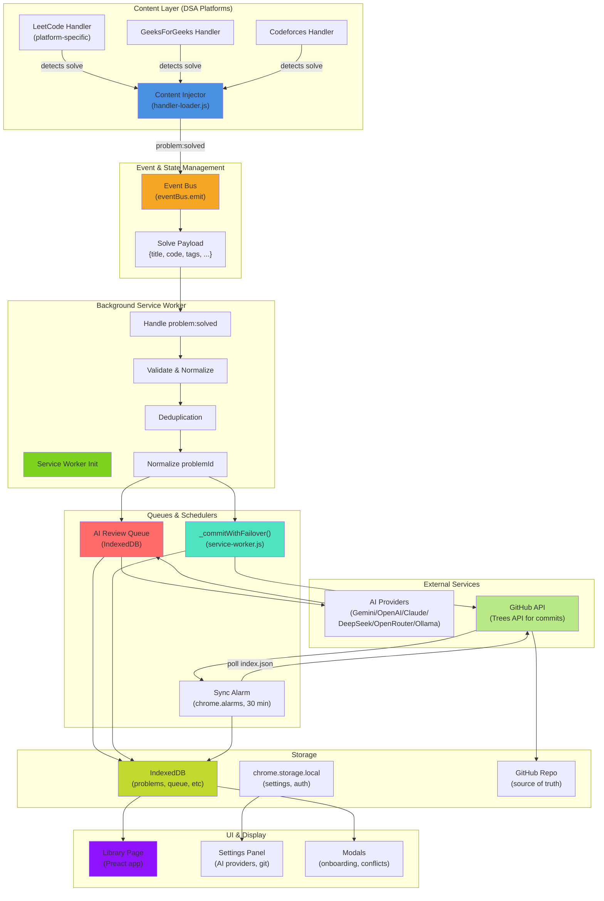
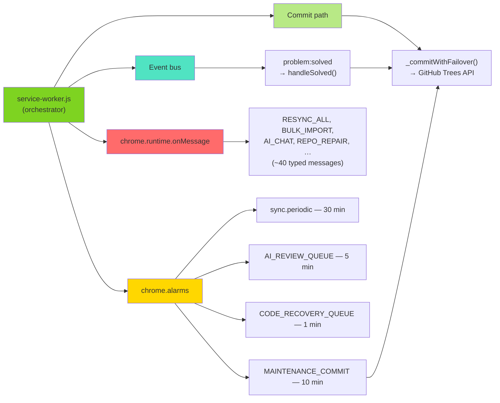
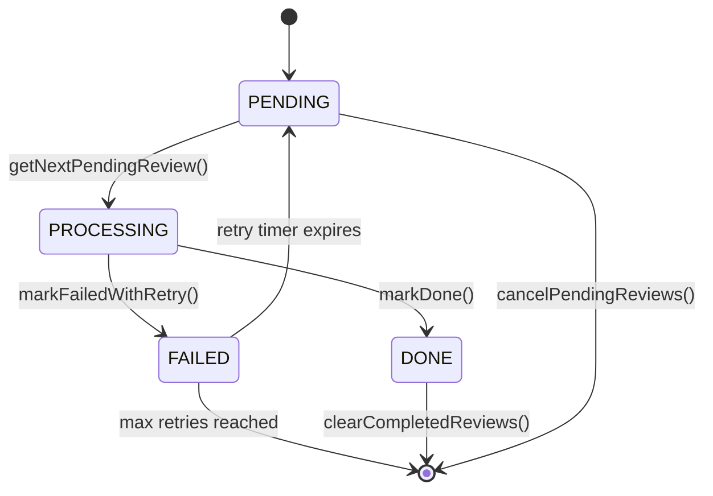
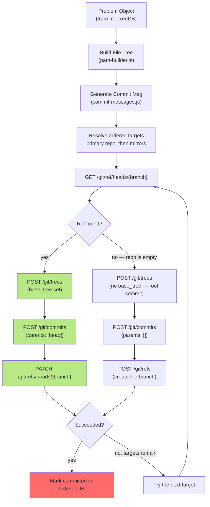
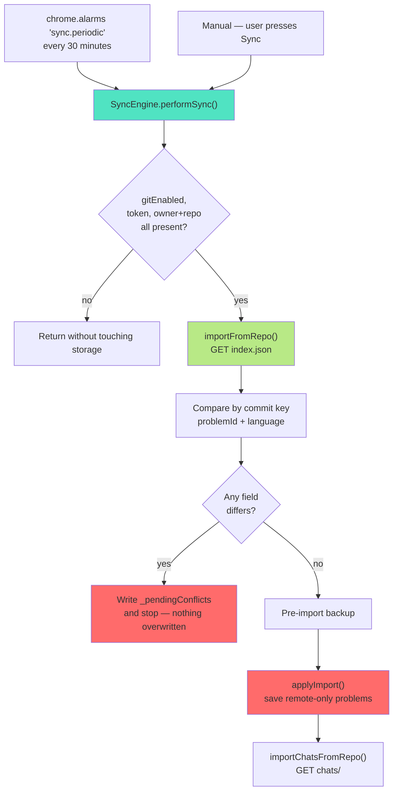
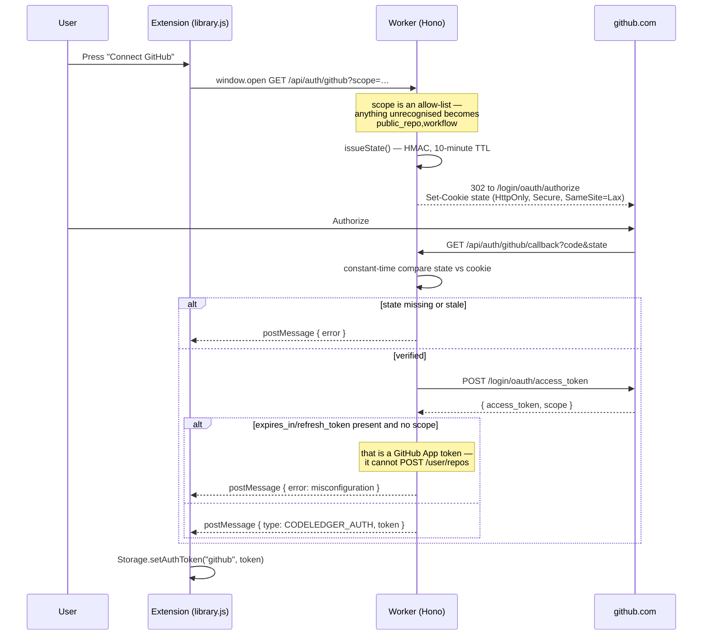
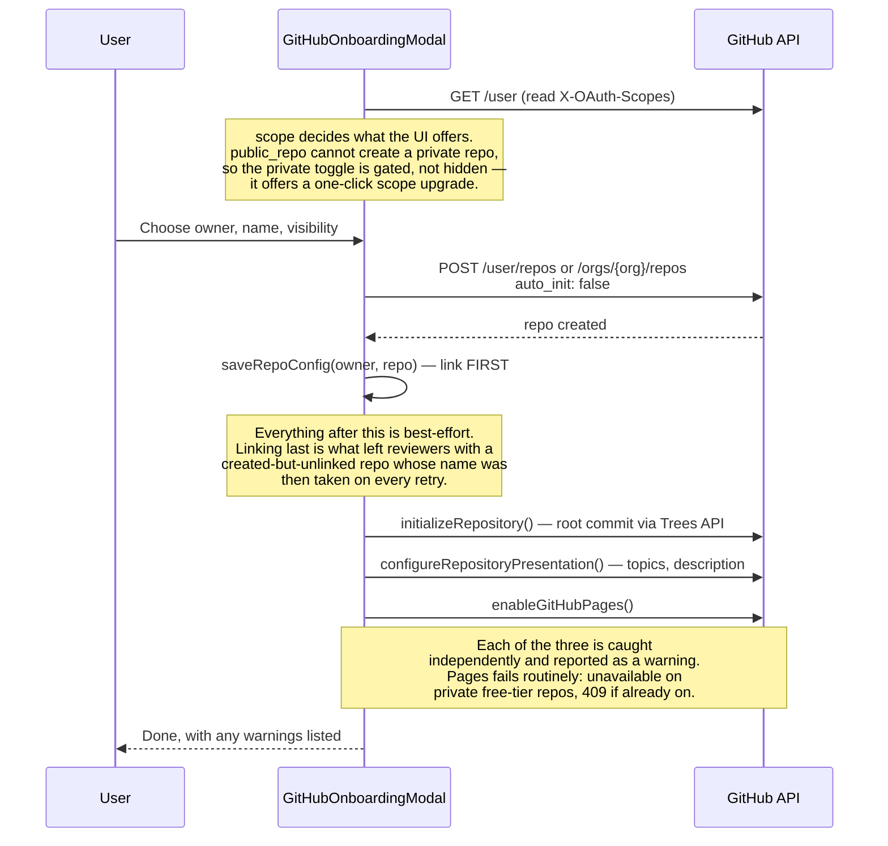
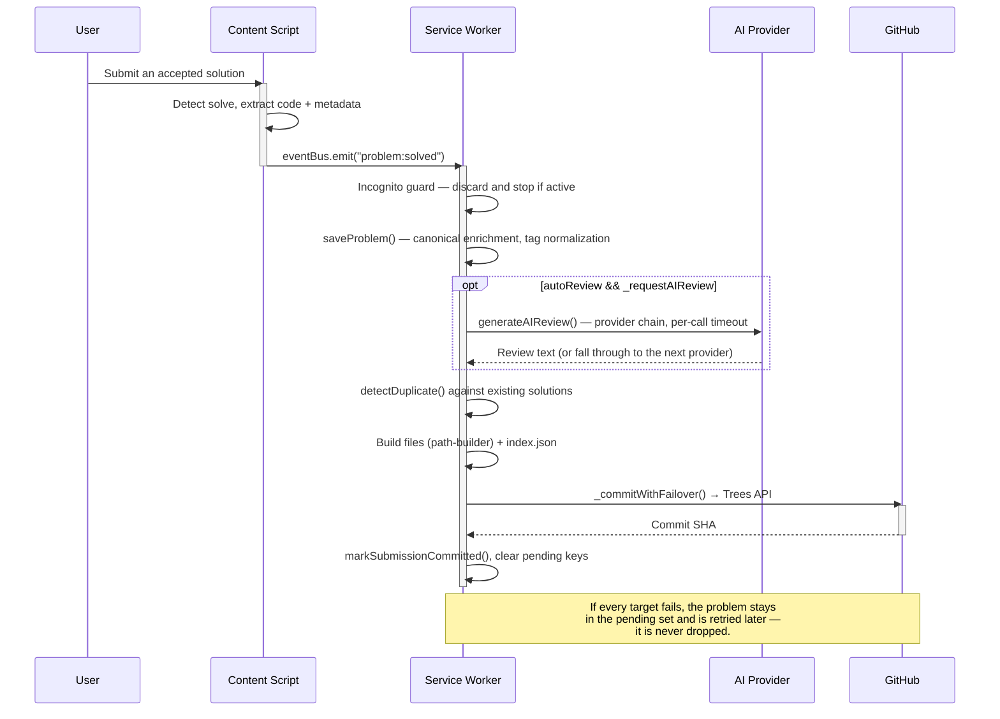

# CodeLedger Complete System Architecture

**Comprehensive overview of all components, data flows, and interactions**

---

## Quick Links

- **[Queues & Orchestration](../queues/orchestration.md)** — AI Review, Commit, and Sync Queues
- **[Architecture](./README.md)** — High-level system design
- **[Adding Platform Handlers](../guides/development/adding-platform-handler.md)** — Extend to new platforms
- **[Graphify Workflow](../guides/development/graphify-workflow.md)** — Build and inspect project knowledge graph

---

## Complete System Flowchart



---

## Component Breakdown

### 1. Content Scripts Layer

**Purpose:** Detect when user solves a DSA problem on supported platforms

| Component             | File                                             | Responsibility                             |
| --------------------- | ------------------------------------------------ | ------------------------------------------ |
| **Handler Loader**    | `src/content/handler-loader.js`                  | Router: matches hostname → imports handler |
| **Platform Handlers** | `src/handlers/platforms/{name}/`                 | Detects solve, extracts metadata           |
| **DOM Detectors**     | `src/handlers/platforms/{name}/page-detector.js` | Identify page type (problem, solve, etc)   |
| **Heartbeat**         | `src/content/heartbeat.js`                       | Keepalive for service worker connection    |

**Data Extracted:**

```javascript
{
    title: "Two Sum",                    // Problem name
    titleSlug: "two-sum",                // URL-safe name
    code: "function twoSum(...) { ... }", // User's solution
    lang: { name: "JavaScript", ext: "js", slug: "js" },
    platform: "leetcode",                // Platform ID
    difficulty: "Easy",                  // Normalized difficulty
    runtime: "75ms",                     // Performance metrics
    memory: "45MB",
    runtimePct: 95,                     // Percentile ranking
    memoryPct: 87,
    tags: ["array", "hash-table"],      // Problem tags
    timestamp: Date.now(),               // Unix milliseconds
    elapsedSeconds: 245,                 // Time spent solving (from floating timer)
}
```

---

### 2. Event Bus & Orchestration

**Purpose:** Decouple platform detection from processing logic

**File:** `src/core/event-bus.js`

```javascript
// Publish from content script
eventBus.emit("problem:solved", {
  title: "Two Sum",
  code: "...",
  // ... rest of payload
});

// Consume in service worker
eventBus.on("problem:solved", async (payload) => {
  // Process: validate, deduplicate, commit, enqueue
});
```

**`problem:solved` is the only event the bus carries.** Everything else the UI
asks the service worker to do travels as a typed `chrome.runtime.sendMessage`
payload (`{ type: "RESYNC_ALL" }`, `{ type: "REFRESH_METADATA" }`,
`{ type: "AI_CHAT" }`, and so on), handled by the single `onMessage` listener at
the bottom of `service-worker.js`. Do not add events to this list without a
matching `eventBus.on()` registration — a name with no listener is silently
dropped.

---

### 3. Service Worker (Background)

**Purpose:** Orchestrate all processing, manage queues, handle GitHub integration

**File:** `src/background/service-worker.js`

#### Main Responsibilities



The four periodic alarms are created in `init()` alongside the reminder alarms
in `alarm-manager.js`. `MAINTENANCE_COMMIT` is the reason AI reviews and
refreshed metadata do not each produce their own commit: it batches whatever
accumulated over the interval into one atomic Trees API write.

#### Key Functions

| Function                                    | Purpose                                                  | Async |
| ------------------------------------------- | -------------------------------------------------------- | ----- |
| `init()`                                    | Bootstrap: storage, migrations, alarms, first-run defaults | ✓     |
| `handleSolved(data)`                        | The `problem:solved` handler — the main write path         | ✓     |
| `generateAIReview(problem, settings)`       | Call the configured AI provider, with fallbacks            | ✓     |
| `commitUpdatedProblem(problem, settings)`   | Rebuild one problem's files and commit                     | ✓     |
| `_commitWithFailover(files, message, …)`    | Try each configured target in order until one accepts      | ✓     |
| `processAIReviewQueue(options)`             | `AI_REVIEW_QUEUE` alarm handler                            | ✓     |
| `processCodeRecoveryQueue()`                | `CODE_RECOVERY_QUEUE` alarm handler                        | ✓     |
| `handleResyncAll(mode, commitType)`         | Rebuild the whole repo from local IndexedDB                | ✓     |
| `handleSyncPreview()` / `handleSyncApplyImport(problems)` | Two-step import: diff first, then apply       | ✓     |

Every one of these logs through `createDebugger("ServiceWorker")`. There is no
per-function log level: `src/lib/debug.js` holds a single boolean, read from the
`codeledger.debug` storage key at startup (or forced by `CONSTANTS.DEBUG_OVERRIDE`).
When it is off, the debug methods are replaced with a no-op, so disabled logging
costs nothing at the call site.

---

### 4. AI Review Queue System

**Purpose:** Manage asynchronous AI reviews with retry logic and prioritization

**File:** `src/core/ai-review-queue.js`

#### State Machine



#### Operations & Logging

```javascript
// Each operation has comprehensive debug logging:

// 1. Initialize queue store
async function initializeReviewQueueStore() {
  dbg.log(`initializeReviewQueueStore(): creating indexes...`);
  // Creates IndexedDB + indexes
  dbg.log(`initializeReviewQueueStore(): ✓ store ready`);
}

// 2. Enqueue a review
async function enqueueReview(problemId, priority = 100) {
  dbg.log(`enqueueReview(${problemId}, priority=${priority}): entering`);

  // Check for duplicates
  const existing = await getPendingReviewsForProblem(problemId);
  if (existing.length > 0) {
    dbg.log(`enqueueReview(): ${problemId} already queued — skipping`);
    return { skipped: true };
  }

  // Insert into queue
  const id = `review-${problemId}-${Date.now()}`;
  // ... database insert

  dbg.log(`enqueueReview(): ✓ ${problemId} added to queue (id=${id})`);
  return { id, status: "pending", skipped: false };
}

// 3. Get next item
async function getNextPendingReview() {
  dbg.log(`getNextPendingReview(): fetching next pending item...`);

  const item = await _queryQueueBy("status", "pending");

  if (!item) {
    dbg.log(`getNextPendingReview(): queue empty`);
    return null;
  }

  dbg.log(
    `getNextPendingReview(): ✓ found ${item.problemId} (priority=${item.priority})`,
  );
  return item;
}

// 4. Mark as processing
async function markProcessing(itemId) {
  dbg.log(`markProcessing(${itemId}): transitioning to PROCESSING...`);

  await _updateQueueItem(itemId, {
    status: "processing",
    lastAttempt: Date.now(),
  });

  dbg.log(`markProcessing(${itemId}): ✓ now processing`);
}

// 5. Mark as done
async function markDone(itemId) {
  dbg.log(`markDone(${itemId}): transitioning to DONE...`);

  await _updateQueueItem(itemId, {
    status: "done",
    updatedAt: Date.now(),
  });

  dbg.log(`markDone(${itemId}): ✓ complete`);
}

// 6. Mark as failed with retry
async function markFailedWithRetry(itemId, error) {
  dbg.log(`markFailedWithRetry(${itemId}): error=${error}`);

  const item = await _getQueueItem(itemId);
  const retryCount = (item.retryCount || 0) + 1;

  if (retryCount > MAX_RETRIES) {
    dbg.error(`markFailedWithRetry(${itemId}): max retries exceeded`);
    // ... stay in FAILED
  } else {
    const backoff = Math.min(
      RETRY_BASE_DELAY_MS * Math.pow(2, retryCount - 1),
      RETRY_MAX_DELAY_MS,
    );
    const nextRetryTime = Date.now() + backoff;

    dbg.log(
      `markFailedWithRetry(${itemId}): retry #${retryCount} scheduled for +${backoff}ms`,
    );

    await _updateQueueItem(itemId, {
      status: "failed",
      retryCount,
      nextRetryTime,
      error,
      updatedAt: Date.now(),
    });
  }
}

// 7. Get statistics
async function getQueueStats() {
  dbg.log(`getQueueStats(): fetching current queue status...`);

  const stats = {
    pending: 0,
    processing: 0,
    done: 0,
    failed: 0,
    total: 0,
  };

  // Count by status
  // ...

  dbg.log(
    `getQueueStats(): ✓ pending=${stats.pending}, processing=${stats.processing}, done=${stats.done}, failed=${stats.failed}`,
  );
  return stats;
}
```

---

### 5. Commit Path

**Purpose:** Create atomic, multi-file commits to GitHub using Trees API

There is no `git-engine.js`. Commits go through the GitHub handler, which the
service worker calls behind a failover wrapper.

**File:** `src/handlers/git/github/index.js`, called through `_commitWithFailover()` in `src/background/service-worker.js`

#### Commit Flow



The empty-repo branch is not an edge case to skip over. New repositories are
created with `auto_init: false` so GitHub does not add a README of its own,
which means the first commit has no parent and no base tree, and the branch ref
must be created rather than patched. Treating that as an error is what made
first-time setup fail.

#### Repository Layout

Paths come from `src/core/path-builder.js`. Everything lives under `problems/`,
and the shape depends on whether the problem resolved to a canonical ID:

```
# Canonical ID resolved — one directory shared by every platform that has it
problems/two-sum/README.md                    ← shared notes
problems/two-sum/leetcode/lc-two-sum.py       ← solution
problems/two-sum/leetcode/README.md           ← description, AI review, solve info
problems/two-sum/geeksforgeeks/gfg-two-sum.py ← the same problem, other platform

# No canonical ID — the platform-scoped ID is the directory
problems/lc-two-sum/lc-two-sum.py
problems/lc-two-sum/README.md

# A second approach to the same problem gets a suffix, not a second directory
problems/lc-two-sum/lc-two-sum-greedy.py

index.json                                    ← always the last file in the commit
```

`index.json` at the repo root is what the sync engine reads on another device.
The service worker appends it to every commit, so the index can never lag the
files it describes — they land in the same atomic tree.

#### Commit Message Types

Every message is built by `buildCommitMessage(type, data)` in
`src/core/commit-messages.js`. The taxonomy is a bracketed prefix, not
Conventional Commits — six types, and an unknown type falls back to `[chore]`:

| `COMMIT_TYPES` value    | Produces                                          | Raised by                                     |
| ----------------------- | ------------------------------------------------- | --------------------------------------------- |
| `SOLVED`                | `[solved] Two Sum (Python) — Arrays`              | A new solve                                   |
| `UPDATE`                | `[update] Two Sum — synced`                       | An existing problem changed                   |
| `COMPREHENSIVE_UPDATE`  | `[comprehensive-update] import 42 submissions (leetcode)` | Profile / bulk import              |
| `MAINTENANCE`           | `[maintenance] repo updated (7 files)`            | The `MAINTENANCE_COMMIT` alarm batch          |
| `CHORE`                 | `[chore] sync 3 pending problems`                 | Resync of anything still uncommitted          |
| `INIT`                  | `[init] CodeLedger repo initialized`              | First-run repository setup                    |

---

### 6. Sync Engine (Cross-Device)

**Purpose:** Keep problems in sync across multiple devices

**File:** `src/background/sync-engine.js`

#### Sync Triggers



Two details the diagram is load-bearing on. The comparison key is
`problemId + language`, so the same problem solved in a second language is new
work rather than a conflict. And a detected conflict **halts the import** — the
count is recorded for the settings UI and the user resolves it. Sync never picks
a winner on the user's behalf.

#### Import Logic

```javascript
// Sync flow pseudocode
async function importFromRepo() {
  dbg.log(`importFromRepo(): fetching latest index.json...`);

  // 1. Fetch remote index
  const remoteIndex = await ghGetContents(owner, repo, "index.json");

  dbg.log(
    `importFromRepo(): ✓ fetched ${Object.keys(remoteIndex).length} remote problems`,
  );

  // 2. Get local problems
  const localProblems = await Storage.getAllProblems();
  const localIndex = {};
  localProblems.forEach((p) => {
    localIndex[p.problemId] = p;
  });

  dbg.log(
    `importFromRepo(): local has ${Object.keys(localIndex).length} problems`,
  );

  // 3. Detect new (not in local)
  const newProblems = [];
  for (const [problemId, remote] of Object.entries(remoteIndex)) {
    if (!localIndex[problemId]) {
      dbg.log(`importFromRepo(): new problem detected: ${problemId}`);
      newProblems.push(remote);
    }
  }

  // 4. Import each new problem
  for (const remote of newProblems) {
    const imported = await applyImport(remote);
    dbg.log(`importFromRepo(): ✓ imported ${remote.problemId}`);
  }

  dbg.log(
    `importFromRepo(): ✓ sync complete — ${newProblems.length} new problems`,
  );
}
```

---

### 6a. Authentication and First-Run Repository Setup

**Files:** `worker/src/index.js`, `src/library/library.js`,
`src/ui/components/GitHubOnboardingModal.js`,
`src/handlers/git/github/api-client.js`

#### OAuth sign-in



The token is never written to `settings`; it goes to `auth.tokens` and is read
back through `Storage.getAuthToken("github")`.

#### Creating the ledger repository



---

### 7. Settings Management

**Purpose:** Persist and sync user configuration (providers, git setup, etc)

**File:** `src/core/settings-sync.js` + `src/core/settings-auto-commit.js`

#### Where settings live

Settings are one flat object in `chrome.storage.local` under the `settings` key —
not a nested schema. Secrets are deliberately kept out of it:

| Data                | Key                                    | Written by                            |
| ------------------- | -------------------------------------- | ------------------------------------- |
| User preferences    | `settings`                             | `Storage.setSettings()`               |
| OAuth tokens        | `auth.tokens`                          | `Storage.setAuthToken(provider, tok)` |
| AI provider keys    | `ai.keys`                              | `Storage.setAIKeys(map)`              |
| Debug flag          | `codeledger.debug`                     | `Storage.setDebugEnabled()`           |

Every key name comes from `CONSTANTS.SK` in `src/core/constants.js`. Never write
a literal — a typo here does not throw, it silently reads back `undefined`.

#### Auto-Commit Logic

Settings are **not** committed on a timer. `settings-auto-commit.js` keeps a flag
and piggybacks on the next commit that was going to happen anyway:

1. A settings change calls `markSettingsPendingCommit()`, which sets
   `settings._pending_commit` and stores a hash of the portable subset.
2. The next commit calls `getConfigFileForCommit()`. If the flag is unset it
   returns `null` and nothing extra is written; otherwise it returns
   `{ path: ".codeledger/config.json", content }`, which joins that commit's file
   list.
3. After the commit succeeds, `clearSettingsCommitFlag()` unsets the flag.

Only the **portable** subset is written — the explicit `PORTABLE_SETTINGS` list
in `_extractPortableSettings()` (theme, review/commit/sync toggles, Pages
options, MCP config). Repository names, owners, tokens, and API keys are not on
that list, so the config file that lands in a user's public repository carries no
credentials and no identifiers. That list must stay in step with the one in
`settings-sync.js`; if the two drift, a key round-trips through GitHub in one
direction only.

`forceCommitSettingsNow()` exists for the "Commit settings now" button and takes
the same path, tagged `[maintenance] settings: force commit`.

---

### 8. Storage Abstraction

**Purpose:** Unified interface for IndexedDB + chrome.storage.local

**File:** `src/core/storage.js`

`Storage` is a plain exported object, not a class — call the methods on it
directly; there is nothing to instantiate.

```javascript
import { Storage } from "../core/storage.js";

// Problems — IndexedDB
await Storage.saveProblem(problem); // upsert, keyed by problem.id
await Storage.getProblem(id);
await Storage.getAllProblems();
await Storage.deleteProblem(id);

// Settings, keys, tokens — chrome.storage.local
await Storage.getSettings();
await Storage.setSettings(settings); // whole object, not a patch
await Storage.getAIKeys();
await Storage.setAIKeys(map);
await Storage.getAuthToken("github");
await Storage.setAuthToken("github", token);
```

`setSettings()` takes the **entire** settings object, not a partial update. The
read-modify-write is the caller's job:

```javascript
const settings = await Storage.getSettings();
settings.autoCommit = true;
await Storage.setSettings(settings);
```

Beyond these, `storage.js` also owns the commit-bookkeeping stores that keep the
extension from re-committing work it has already pushed —
`markSubmissionCommitted` / `isSubmissionCommitted`, the pending-problem key set,
and the pending-rename list. Sync correctness depends on these; read the file
before changing how a commit key is derived.

---

## Data Structures

### Problem Object

```typescript
interface Problem {
  // Identity. `id` is the IndexedDB keyPath — the store is created with
  // { keyPath: "id" }, so a record without it cannot be written.
  id: string; // "lc-two-sum" — CONSTANTS.makeProblemId(platform, titleSlug)
  title: string; // "Two Sum"
  titleSlug: string; // "two-sum"

  // Platform Info
  platform: string; // "leetcode" | "geeksforgeeks" | "codeforces"
  difficulty: "Easy" | "Medium" | "Hard";
  tags: string[]; // normalized through normalizeTag() + settings.topicMappings
  topic: string; // folder name

  // Code. A problem holds either one `code` blob or several `methods`;
  // path-builder reads `methods` first and falls back to `code`.
  code: string;
  lang: { name: string; ext: string; slug: string };
  methods?: Array<{ title: string; description: string; code: string; lang: object }>;

  // Canonical mapping — attached by saveProblem() unless manuallyEdited.
  // Its presence is what decides the repository layout (see §5).
  canonical?: { id: string; topic?: string; tags?: string[] };
  manuallyEdited?: boolean; // true = never overwrite from canonical enrichment

  // Performance
  runtime?: string;
  memory?: string;
  runtimePct?: number;
  memoryPct?: number;

  // Metadata
  timestamp: number; // Unix milliseconds
  elapsedSeconds?: number; // from the floating timer; 0 if unused
  aiReview?: string;
  notes?: string; // user-authored, preserved across re-solves

  // Pre-built by the platform handler; drives the commit
  files?: Array<{ path: string; content: string }>;
}
```

`saveProblem()` merges rather than replaces: `notes`, `methods`, and
`manuallyEdited` fall back to the stored record when the incoming one omits
them. A re-solve therefore cannot wipe notes the user wrote — rely on that
rather than re-reading and re-sending them.

Commit state is **not** a field on this object. It lives in separate stores
(`markSubmissionCommitted`, the pending-key set), so a problem record can be
rewritten freely without disturbing what has already been pushed.

### Queue Item Object

```typescript
interface QueueItem {
  id: string; // "review-lc/1-1715600000000"
  problemId: string; // "lc/1"
  status: "pending" | "processing" | "done" | "failed";
  priority: number; // 0 = highest
  retryCount: number; // Current retry attempt
  lastAttempt?: number; // Unix ms of last processing attempt
  nextRetryTime?: number; // When to retry (for failed)
  error?: string; // Error message if failed
  createdAt: number; // Queue item creation time
  updatedAt: number; // Last status change time
}
```

---

## Request/Response Flow Summary

The AI review is **not** deferred on the happy path. When `autoReview` is on and
the handler set `_requestAIReview`, `handleSolved()` awaits the review before
building the file list, so the review ships inside the same commit as the code.
The queue exists for the other case — reviews requested later, in bulk, for
problems already in the ledger.



The backfill path is the mirror image: `QUEUE_ALL_AI_REVIEWS` enqueues, the
`AI_REVIEW_QUEUE` alarm drains it every 5 minutes writing reviews to IndexedDB,
and the `MAINTENANCE_COMMIT` alarm sweeps whatever changed into one commit every
10 minutes — which is why a bulk review run does not produce one commit per
problem.

---

## Key Configuration Constants

**File:** `src/core/constants.js` — the single source of truth. Read it there
rather than trusting a copy; the values below are a pointer, not a mirror.

| Export                  | What it holds                                                                                                     |
| ----------------------- | ------------------------------------------------------------------------------------------------------------------ |
| `VERSION`               | Read from the running manifest via `runtime.getManifest()`, so it cannot drift from what was packaged             |
| `PLATFORMS`             | `leetcode`, `geeksforgeeks`, `codeforces`                                                                          |
| `PLATFORM_CODE`         | The prefix in every problem id — `lc`, `gfg`, `cf`                                                                 |
| `AI_PROVIDERS`          | Six providers, each with `endpoint`, `modelsEndpoint`, `defaultModel`, `supportsLiveFetch`, `keyRequired`          |
| `ALARM_NAMES`           | `sync.periodic`, `reminder.daily`, `reminder.streak` — the literal strings `alarm-manager.js` registers and matches |
| `SYNC_ALARM_PERIOD_MIN` | `30`                                                                                                               |
| `SK`                    | Every storage key name. Never write a key as a literal — an unmatched literal reads as authoritative and silently disconnects whatever it was meant to control |

`makeProblemId(platform, titleSlug)` on the same object builds the
platform-scoped id (`lc-two-sum`) that everything else keys on.

---

## Debugging & Monitoring

### Enable Full Debug Logging

Turn on **Debug mode** in the library's Advanced settings panel. That writes the
`codeledger.debug` key and calls `setDebug(true)` for the current page; other
contexts (service worker, content scripts) pick it up on their next `initDebug()`,
so **reload the extension** to see logs from a flow that already started.

Output is namespaced by whatever string the module passed to `createDebugger`:

```javascript
const dbg = createDebugger("MyModule");
dbg.log("Entry point"); // [CodeLedger:MyModule] Entry point
dbg.warn("Warning"); // [CodeLedger:MyModule] Warning
dbg.error("Error", error); // [CodeLedger:MyModule] Error …
```

Because each method is a getter returning a bound `console.*`, DevTools reports
the **caller's** file and line rather than `debug.js`. Do not wrap these in a
helper of your own; that indirection is exactly what the binding avoids.

Failures that must be visible even with debug off — auth expiry, for instance —
go through `rawError()`, which bypasses the flag. Use it sparingly.

### Monitor Queue Health

The queue functions are module exports, not globals, so they cannot be called
from an arbitrary console. Ask the service worker instead — from any extension
page (the library, the popup, its DevTools console):

```javascript
await chrome.runtime.sendMessage({ type: "GET_QUEUE_STATS" });
await chrome.runtime.sendMessage({ type: "GET_QUEUE_ITEMS" });
await chrome.runtime.sendMessage({ type: "GET_AI_REVIEW_QUEUE_STATUS" });
```

To drain it now rather than waiting for the 5-minute alarm, send
`PROCESS_REVIEW_QUEUE_NOW`; `CANCEL_AI_REVIEW_QUEUE` stops it. A stuck item is
almost always one left in `processing` by a service worker that was evicted
mid-call — `markFailedWithRetry` only runs on a caught error, not on termination.

---

## Architecture Inference Snapshot (Graphify)

Recent full-project graph inference indicates:

- Strong queue cohesion around review queue operations (enqueue, retry, cancel, stats).
- Potential coupling seam between AI chat storage and MCP tools.
- Vendor bundle symbol collisions can produce noisy inferred cross-links.
- Community and hub ranking become more useful when vendor-heavy edges are filtered in review.

Use this as an investigation guide for architecture reviews. Confirm inferred edges in source before making design decisions.

---

## Related Documents

- [Queues & Orchestration](../queues/orchestration.md) — Detailed queue architecture
- [Architecture](./README.md) — System-wide design
- [Adding Platform Handlers](../guides/development/adding-platform-handler.md) — Extend to new sites
- [Graphify Workflow](../guides/development/graphify-workflow.md) — Reproduce and inspect knowledge graph outputs

---

**Applies to:** CodeLedger 1.0.0 | **Last verified against the source:** 10 August 2026
