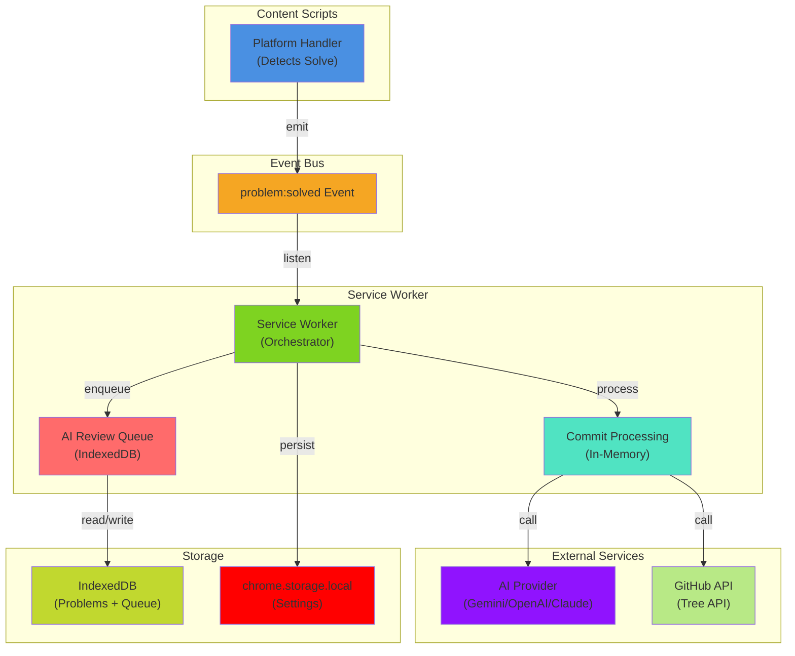
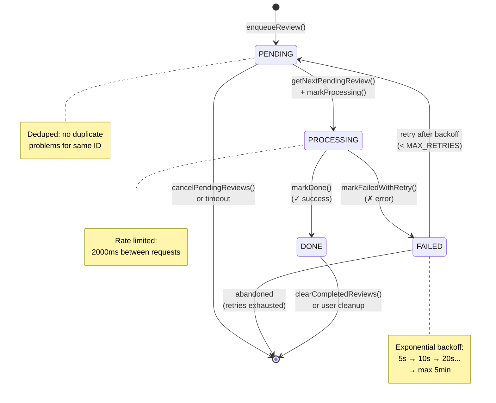
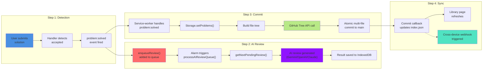
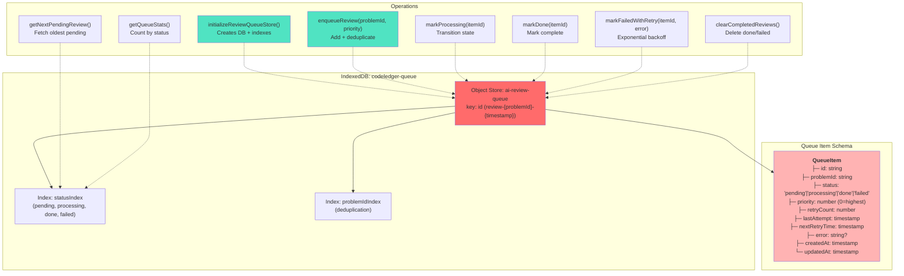
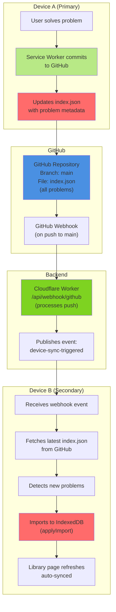
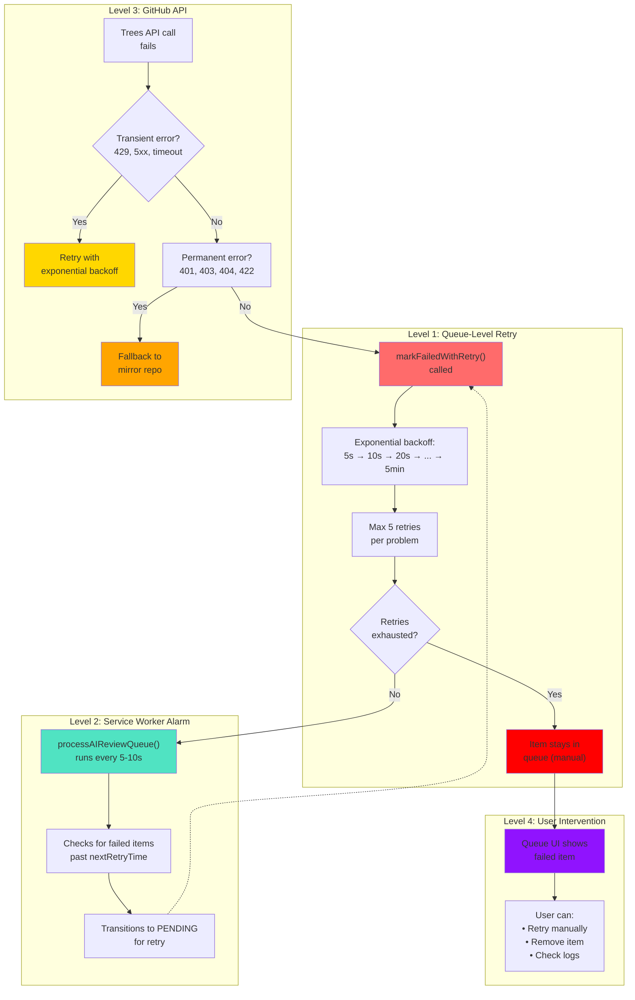
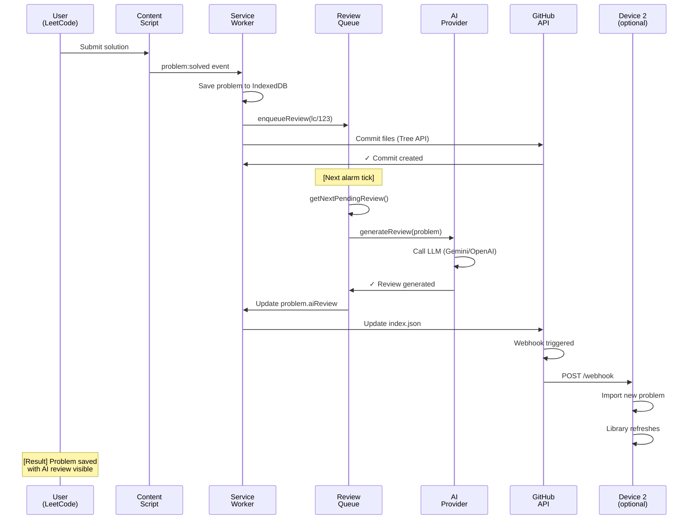
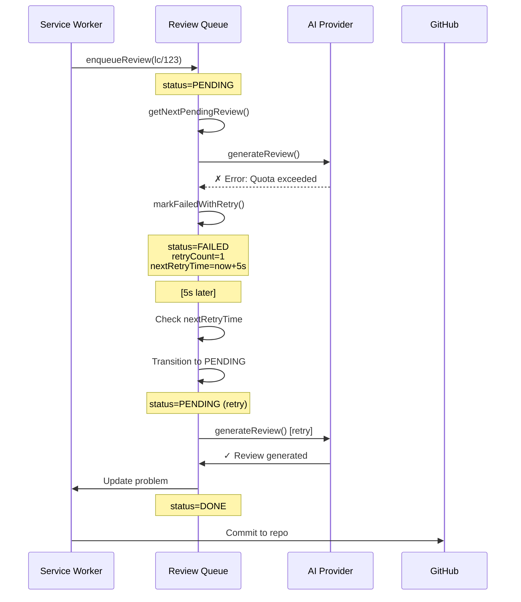
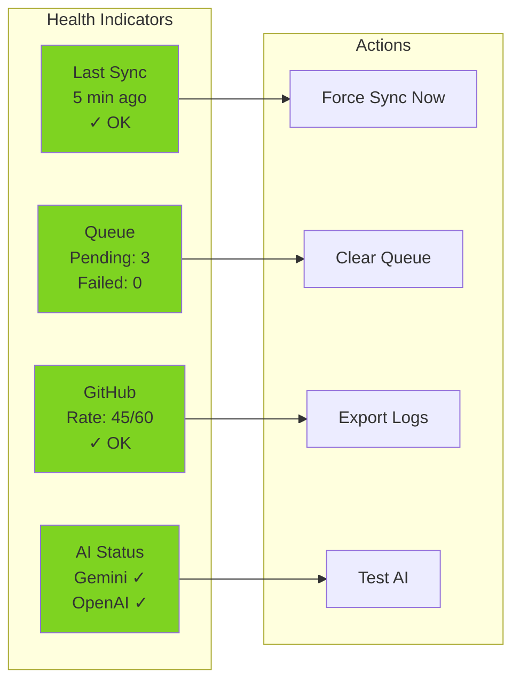

# CodeLedger Queue Systems & Orchestration

**Comprehensive guide to AI Review Queue, Commit Processing, and Synchronization Pipeline**

---

## Table of Contents

1. [Overview](#overview)
2. [Architecture Diagrams](#architecture-diagrams)
3. [AI Review Queue System](#ai-review-queue-system)
4. [Commit Processing Pipeline](#commit-processing-pipeline)
5. [Synchronization Engine](#synchronization-engine)
6. [Error Handling & Retry Logic](#error-handling--retry-logic)
7. [Data Flow Examples](#data-flow-examples)
8. [Configuration & Monitoring](#configuration--monitoring)

---

## Overview

CodeLedger uses a **multi-layered queue system** to manage problem-solving events, AI reviews, and GitHub commits asynchronously and reliably:

| Component                  | Purpose                                                      | Storage              | Persistence           |
| -------------------------- | ------------------------------------------------------------ | -------------------- | --------------------- |
| **AI Review Queue**        | Enqueue, prioritize, and process AI reviews with retry logic | IndexedDB            | ✅ Cross-session      |
| **Commit Queue**           | Batched GitHub commits for solved problems                   | Memory + GitHub      | ✅ Resumed on restart |
| **Sync Engine**            | Cross-device sync via GitHub repo index                      | GitHub + IndexedDB   | ✅ Webhook-triggered  |
| **Settings Commit Queue**  | Auto-commit settings changes on interval                     | chrome.storage.local | ✅ Persisted          |
| **Metadata Refresh Queue** | Background metadata refresh for problems                     | In-flight state      | ⚠️ Per-session        |

**Key Properties:**

- **Persistent**: Survives browser crashes, restarts, and closed tabs
- **Prioritized**: Problems can be prioritized (lower = higher priority)
- **Retry-aware**: Exponential backoff with max retries before manual intervention
- **Rate-limited**: Respects GitHub API rate limits with adaptive delays
- **Observable**: Full debug logging at each transition

---

## Architecture Diagrams

### System Overview Flowchart



**Legend:**

- **Blue** = Content Script (HTML injection)
- **Orange** = Event System
- **Green** = Background Service Worker
- **Red** = Queue Systems
- **Purple/Teal** = External Services
- **Yellow** = Storage

---

### AI Review Queue State Machine



**Transitions:**

- **PENDING → PROCESSING**: Next item pulled by review processor alarm
- **PROCESSING → DONE**: AI review succeeds, problem updated
- **PROCESSING → FAILED**: Network error, rate limit, or AI error
- **FAILED → PENDING**: Retry with exponential backoff (retryCount < 5)
- **FAILED → [*]**: All retries exhausted, manual intervention needed

---

### Problem Solve Complete Flow



**Timing:**

- Steps 1-3 happen within 1-2 seconds of solve
- Step 2 (AI Review) happens on scheduled alarm (default: every 5-10 seconds)
- Step 4 (Sync) triggered by webhook (GitHub → Cloudflare Worker → Extension)

---

### Detailed Queue Architecture



---

## AI Review Queue System

### Detailed Specification

**File:** [`src/core/ai-review-queue.js`](../src/core/ai-review-queue.js)

#### Key Features

| Feature            | Implementation                                             | Notes                        |
| ------------------ | ---------------------------------------------------------- | ---------------------------- |
| **Persistence**    | IndexedDB (`codeledger-queue` DB)                          | Survives browser restart     |
| **Deduplication**  | Query by `problemId` before enqueuing                      | Prevents duplicate reviews   |
| **Prioritization** | `priority` field (0 = highest)                             | Lower wins in sort order     |
| **Retry Logic**    | Exponential backoff: 5s → 10s → 20s → 40s → 80s → 300s max | Max 5 retries (configurable) |
| **Rate Limiting**  | 2000ms between requests (configurable)                     | Respects GitHub API limits   |
| **Debugging**      | Full `createDebugger("AIReviewQueue")` logging             | Track state transitions      |

#### Database Schema

```javascript
{
    id: "review-lc/123-1715600000000",      // Unique: review-{problemId}-{timestamp}
    problemId: "lc/123",                    // Platform-scoped problem ID
    status: "pending",                      // pending | processing | done | failed
    priority: 100,                          // Lower = higher priority
    retryCount: 0,                          // Current retry attempt
    lastAttempt: null,                      // Timestamp of last processing attempt
    nextRetryTime: null,                    // When to retry (for failed items)
    error: null,                            // Error message if failed
    createdAt: 1715600000000,               // Created timestamp
    updatedAt: 1715600000000,               // Last updated timestamp
}
```

#### Example: Complete Review Flow

```javascript
// 1. Enqueue a review
const result = await enqueueReview("lc/123", 50);
// → { id: "review-lc/123-1715600000000", status: "pending", skipped: false }

// 2. Service worker polls on alarm (every 5-10 seconds)
const nextItem = await getNextPendingReview();
// → Returns oldest pending item (sorted by priority ASC, createdAt ASC)

// 3. Mark as processing
await markProcessing(nextItem.id);
// → Updates status to "processing", sets lastAttempt

// 4. AI provider generates review
const review = await aiProvider.generateReview(problem);
// → Returns { content: "...", suggestions: [...] }

// 5. Save review to problem
problem.aiReview = review.content;
await Storage.setProblems([problem]);

// 6. Mark as done
await markDone(nextItem.id);
// → Updates status to "done", updatedAt = now()

// 7. On next cleanup, remove from queue
await clearCompletedReviews();
// → Deletes all done/failed items
```

#### Error Handling & Retries

```javascript
// If AI review fails:
try {
  const review = await aiProvider.generateReview(problem);
} catch (error) {
  await markFailedWithRetry(item.id, error.message);
  // → Updates retryCount++, calculates nextRetryTime with backoff
  // → If retryCount >= MAX_RETRIES, stays in "failed" status
  // → Otherwise, item will be retried on next alarm
}

// Backoff calculation:
const backoffMs = Math.min(
  RETRY_BASE_DELAY_MS * Math.pow(2, retryCount),
  RETRY_MAX_DELAY_MS,
);
// 1st retry: 5000ms (5s)
// 2nd retry: 10000ms (10s)
// 3rd retry: 20000ms (20s)
// 4th retry: 40000ms (40s)
// 5th retry: 80000ms (80s)
// 6th+ retry: 300000ms (5min, capped)
```

---

## Commit Processing Pipeline

### How Problems Become GitHub Commits

**Location:** [`src/background/service-worker.js`](../src/background/service-worker.js) → `handleSolved()`

```mermaid
graph LR
    subgraph "Input"
        Event["<b>problem:solved Event</b><br/>title, titleSlug, code, lang,<br/>tags, difficulty, aiReview,<br/>runtime, memory, ..."]
    end

    subgraph "Normalization"
        Step1["Normalize problem ID<br/>(lc/123, gfg/456, cf/789)"]
        Step2["Validate code & metadata<br/>Check for required fields"]
        Step3["Detect duplicate<br/>Compare against existing"]
    end

    subgraph "Preparation"
        Step4["Build file tree<br/>(buildProblemFiles)"]
        Step5["Generate commit message<br/>(resolveCommitType)"]
        Step6["Add index.json entry<br/>(metadata + timestamp)"]
    end

    subgraph "Execution"
        Step7["Call GitHub Trees API<br/>POST /git/trees"]
        Step8["Create commit<br/>POST /git/commits"]
        Step9["Update branch ref<br/>PATCH /git/refs/heads/main"]
    end

    subgraph "Result"
        Step10["Save to IndexedDB<br/>(update problem.committed)"]
        Step11["Enqueue AI review<br/>(if enabled)"]
        Step12["Trigger sync webhook<br/>(update library)"]
    end

    Event --> Step1 --> Step2 --> Step3
    Step3 --> Step4 --> Step5 --> Step6
    Step6 --> Step7 --> Step8 --> Step9
    Step9 --> Step10 --> Step11 --> Step12

    style Event fill:#4A90E2
    style Step7 fill:#B8E986
    style Step10 fill:#FF6B6B
    style Step11 fill:#FF6B6B
```



### File Tree Structure Generated

```javascript
// Example problem solve generates:
{
    topic: "arrays",
    titleSlug: "two-sum",
    files: [
        // User code
        {
            path: "arrays/two-sum/two-sum.js",
            content: "function twoSum(nums, target) { ... }"
        },
        // Runtime metadata
        {
            path: "arrays/two-sum/index.json",
            content: JSON.stringify({
                platform: "leetcode",
                difficulty: "Easy",
                runtime: "75ms",
                memory: "45MB",
                aiReview: "Well-optimized...",
                timestamp: 1715600000000,
                lang: { name: "JavaScript", ext: "js" },
                tags: ["hash-table", "array"]
            }, null, 2)
        }
    ]
}
```

### Commit Message Types

**File:** [`src/core/commit-messages.js`](../src/core/commit-messages.js)

| Type         | Pattern                    | Example                                           |
| ------------ | -------------------------- | ------------------------------------------------- |
| **solve**    | New problem                | `solve(arrays/two-sum): Two Sum`                  |
| **optimize** | Existing problem re-solved | `optimize(arrays/two-sum): Improved solution`     |
| **refactor** | Code improvements          | `refactor(arrays/two-sum): Better variable names` |
| **metadata** | Only metadata changed      | `metadata(arrays/two-sum): Update runtime`        |

---

## Synchronization Engine

### Cross-Device Sync Overview

**File:** [`src/background/sync-engine.js`](../src/background/sync-engine.js)



### Sync Data Flow

```javascript
// On every problem solve:
{
    // Existing index.json (from GitHub)
    index: {
        "lc/1": { title: "Two Sum", ... },
        "lc/2": { title: "Add Two Numbers", ... }
    }

    // New problem to add
    newProblem: {
        problemId: "lc/3",
        title: "Longest Substring",
        platform: "leetcode",
        timestamp: Date.now()
    }

    // After commit, index.json becomes:
    // {
    //     "lc/1": { ... },
    //     "lc/2": { ... },
    //     "lc/3": { title: "Longest Substring", ... }
    // }
}

// On Device B (webhook trigger):
// 1. Fetch updated index.json
// 2. Compare with local IndexedDB index
// 3. For each new problemId in remote:
//    a. Fetch problem files from GitHub
//    b. Import to IndexedDB
//    c. Add to library view
```

---

## Error Handling & Retry Logic

### Multi-Level Retry Strategy



### Error Classification

| Error Type         | Cause                                        | Action                      |
| ------------------ | -------------------------------------------- | --------------------------- |
| **Transient**      | 429 (rate limit), 5xx, timeout, network      | Retry with backoff          |
| **Authentication** | 401 (invalid token), 403 (no permission)     | Prompt re-auth, skip commit |
| **Client Error**   | 400, 422 (bad payload), 404 (repo not found) | Log & fail (no retry)       |
| **Concurrent**     | Duplicate problem already exists             | Deduplicate, update instead |
| **AI Provider**    | Quota exceeded, model unavailable            | Fallback to simpler review  |

### Logging Example

```javascript
// In createDebugger("ServiceWorker"):

dbg.log(`handleSolved(): entering - problem=${problem.titleSlug}`);
dbg.log(`handleSolved(): normalizing ID to platform format`);

// Try commit
try {
  dbg.log(`handleSolved(): calling GitEngine.commit()...`);
  await gitEngine.commit(problem);
  dbg.log(`handleSolved(): ✓ commit succeeded`);
} catch (error) {
  dbg.error(`handleSolved(): commit failed - ${error.message}`);

  if (error.status === 429) {
    dbg.log(`handleSolved(): rate limit detected - will retry`);
    await markFailedWithRetry(queueId, error.message);
  } else if (error.status === 404) {
    dbg.error(`handleSolved(): repo not found - abandoning`);
  }
}

// Enqueue review
dbg.log(`handleSolved(): enqueueing AI review...`);
await enqueueReview(problem.problemId);
dbg.log(`handleSolved(): ✓ review enqueued`);
```

---

## Data Flow Examples

### Example 1: Complete Solve → Review → Commit → Sync



### Example 2: Error & Retry Flow



---

## Configuration & Monitoring

### Configuration Constants

**File:** [`src/core/constants.js`](../src/core/constants.js)

```javascript
// AI Review Queue
const REVIEW_RATE_LIMIT_MS = 2000; // Min interval between reviews
const RETRY_BASE_DELAY_MS = 5000; // Start at 5 seconds
const RETRY_MAX_DELAY_MS = 300000; // Cap at 5 minutes
const MAX_RETRIES = 5; // Max retry attempts

// Alarms (periodic tasks)
const ALARM_NAMES = {
  SYNC: "codeledger-sync", // Full sync every 4 hours
  REVIEW: "codeledger-review-queue", // Process reviews every 5-10s
  SETTINGS_COMMIT: "codeledger-settings", // Commit settings every 30s
  BACKUP: "codeledger-backup", // Backup every 24 hours
};

// Backoff strategy
function calculateBackoff(retryCount) {
  const exponential = RETRY_BASE_DELAY_MS * Math.pow(2, retryCount);
  return Math.min(exponential, RETRY_MAX_DELAY_MS);
}
```

### Monitoring & Debugging

#### Check Queue Status

```javascript
// In browser console (library page):
import { getQueueStats, getAllQueueItems } from "/core/ai-review-queue.js";

// Get stats
const stats = await getQueueStats();
console.log("Queue Stats:", stats);
// Output:
// {
//     pending: 3,
//     processing: 0,
//     done: 42,
//     failed: 2,
//     total: 47
// }

// Get all items
const items = await getAllQueueItems();
console.log("Queue Items:", items);
// Output: [{ id, problemId, status, retryCount, ... }, ...]
```

#### Enable Debug Logging

```javascript
// In browser console:
import { setDebug } from "/lib/debug.js";

// Enable all debug logs
setDebug(true);

// Or enable specific modules:
// Logs will appear as:
// [CodeLedger:ServiceWorker] init(): ✓ debug initialized...
// [CodeLedger:AIReviewQueue] enqueueReview: lc/123 enqueued
// [CodeLedger:GitEngine] commit(): building tree...
```

#### Monitor Alarms

```javascript
// Check all active alarms:
chrome.alarms.getAll((alarms) => {
  console.log("Active Alarms:", alarms);
  // Output:
  // [
  //     { name: 'codeledger-sync', scheduledTime: 1715603600000 },
  //     { name: 'codeledger-review-queue', scheduledTime: 1715600005000 },
  //     { name: 'codeledger-settings', scheduledTime: 1715600030000 }
  // ]
});
```

#### Export Queue State (for debugging)

```javascript
// Export all queue items for debugging
const state = await exportQueueState();
console.log(JSON.stringify(state, null, 2));

// Save to file for analysis
const blob = new Blob([JSON.stringify(state, null, 2)], {
  type: "application/json",
});
const url = URL.createObjectURL(blob);
const a = document.createElement("a");
a.href = url;
a.download = "codeledger-queue-export.json";
a.click();
```

### Health Check Dashboard (Proposed)



---

## Related Documentation

- **[Architecture](../architecture/README.md)** — System-wide architecture overview
- **[System Architecture](../architecture/system-architecture.md)** — Detailed commit flow
- **[OAuth Testing Guide](../guides/setup/oauth-testing-guide.md)** — Auth setup
- **[Adding Platform Handlers](../guides/development/adding-platform-handler.md)** — Platform integration

---

## Glossary

| Term              | Definition                                                     |
| ----------------- | -------------------------------------------------------------- |
| **problemId**     | Platform-scoped ID: `lc/123`, `gfg/456`, `cf/789`              |
| **Queue**         | Persistent FIFO store with retry & prioritization logic        |
| **Enqueue**       | Add item to queue; deduplicates if already pending             |
| **Dequeue**       | Retrieve next item (oldest pending, sorted by priority)        |
| **Backoff**       | Exponential delay between retries: 5s → 10s → 20s → ... → 5min |
| **Rate Limit**    | GitHub API limit; handled with 429 retry strategy              |
| **Atomic Commit** | Single GitHub commit with multiple files (via Trees API)       |
| **Webhook**       | GitHub → Cloudflare Worker → Extension (cross-device sync)     |
| **IndexedDB**     | Browser-local persistent database (survives page close)        |

---

**Document Version:** 1.0
**Last Updated:** May 2026
**Maintained by:** CodeLedger Team
